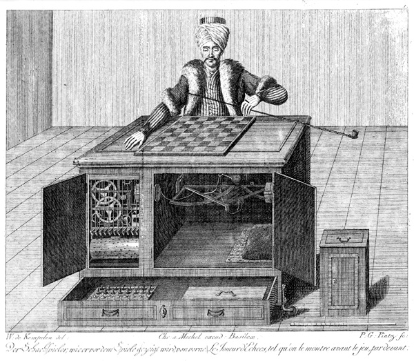

<!-- _class: titlepage -->

# Introducción a la robótica

## Robótica - Grado en Ingeniería de Computadores

### Departamento de Sistemas Informáticos

#### E.T.S.I. de Sistemas Informáticos - Universidad Politécnica de Madrid

##### Curso 2025-2026

---

# ¿Qué es un robot?<!-- _class: section -->

---

---

## ¿Es necesario que sea una máquina autónoma?

---

---

## ¿Es necesario que actúe sobre el mundo físico?

---

---

# Tres perspectivas complementarias

Antes de fijar una definición, conviene comparar tres fuentes de naturaleza distinta:

1. **Lexicográfica**: cómo lo define el uso común de la lengua (RAE)
2. **Normativa**: cómo lo define la industria mediante un estándar internacional (ISO)
3. **Funcional**: qué componentes y capacidades mínimas exige la ingeniería (lo veremos en el bloque de "Componentes esenciales")

Ninguna de las tres es "la correcta" en solitario.

---

# Definición de robot (I): perspectiva lexicográfica

Según la Real Academia Española (RAE, 2024):

1. Máquina o ingenio electrónico programable que es capaz de **manipular** objetos y realizar diversas operaciones
2. Robot que **imita** la **figura** y los **movimientos** de un ser animado
3. Persona que actúa de manera mecánica o sin emociones
4. **Programa** que **explora automáticamente la red** para encontrar información

---

<!-- _class: cite -->

   "A robot is a _machine_ which is programmed to move and perform certain tasks automatically."

---

# Definición de robot (II): perspectiva normativa

El estándar internacional de referencia es la **ISO 8373:2012** — *Robots and robotic devices — Vocabulary* (International Organization for Standardization [ISO], 2012), que define un robot como:

> Un mecanismo **accionado**, **programable en dos o más ejes**, con cierto grado de **autonomía**, capaz de moverse dentro de su entorno para realizar las tareas para las que ha sido diseñado.

Y define **autonomía** como:

> La capacidad de realizar las tareas previstas basándose en el estado actual y en la información sensorial, sin intervención humana.

A diferencia de las definiciones lexicográficas, esta es la que usa la industria para certificar, clasificar y regular robots — y la que usaremos como referencia técnica en el resto del curso.

---

# Etimología

**Robot** viene del eslavo <i>robota</i> (<i>trabajo</i>, con cierto sentido de <i>servidumbre</i>)

- Apareció por primera vez en la obra <i>R.U.R.</i> (<i>Rossumovi univerzální roboti</i>), escrita por Karel Čapek en 1920 y estrenada en 1921 (Čapek, 1920)
- La idea detrás del término se le atribuye a su hermano, Josef Čapek

**Robótica** fue utilizado por primera vez por Isaac Asimov, en 1941

- No fue consciente de que estaba bautizando una nueva rama de la ciencia
- Asumió que "robótica" se refería al trabajo que se realiza con los robots
- Según él, el término se propuso en el relato <i>Círculo vicioso</i> (<i>Runaround</i>, Asimov, 1942), aunque en realidad el relato <i>¡Embustero!</i> (<i>Liar!</i>) fue anterior

---

# Las tres leyes y la ley cero (I)

Asimov propuso en 1942 tres leyes de la robótica en su cuento «Círculo vicioso» (Asimov, 1942):

1. Un robot **no hará daño a un ser humano** ni, por inacción, permitirá que un ser humano sufra daño
2. Un robot debe **cumplir las órdenes dadas por los seres humanos**, a _excepción_ de aquellas que entren en _conflicto con la primera ley_
3. Un robot debe **proteger su propia existencia** a _excepción_ de que esta protección no entre en _conflicto con la primera o con la segunda ley_

---

# Las tres leyes y la ley cero (y II)

Posteriormente (Asimov, 1985) introduce la **Ley Cero**, que tiene prioridad sobre las otras tres:

0. Un robot no puede dañar a la humanidad o, por inacción, permitir que
   la humanidad sufra daños

Introduce complejos dilemas éticos y morales en las decisiones robóticas:

- ¿Qué es más importante, el bienestar de un humano o el de la humanidad?
- **¿«Daño»?**: ¿Qué acciones/situaciones realmente perjudican a la humanidad?
- **Largo vs. corto plazo**: ¿Actuar basándose en predicciones o en hechos concretos?
- **Sacrificio**: puede ser necesario que los robots se sacrifiquen por el bien común
- **Incertidumbre**: ¿cómo decidir en situaciones ambiguas? ¿Cómo priorizan valores?

Aunque son ficción, estos dilemas anticipan debates reales que retomaremos al hablar de arquitecturas de decisión (Tema 4) y de sistemas autónomos armados.

---

# Inteligencia artificial y robótica

Entre otros objetivos, la inteligencia artificial busca **crear máquinas que piensan**

- Pensar requiere, entre otras cosas, **percibir** y **adquirir conocimiento**

¿Cómo se adquiere el conocimiento?

- Reconocimiento de voz
- Inferencias
- Visión artificial

El conocimiento se almacena en memoria de forma _simbólica_ o _subsimbólica_

---

# Evolución de los robots<!-- _class: section -->

---

# Autómatas

Máquinas que imitan la figura y los movimientos de un ser animado

- Son relativamente autónomas
- Siguen automáticamente una secuencia de operaciones
- Responden a una o más instrucciones determinadas

Se tienen registros desde el antiguo Egipto (Máscara de Anubis de mandíbula móvil) hasta nuestros días (Animatrónics)

---

# Principios del siglo XX

En 1912, **Leonardo Torres y Quevedo** construye la primera máquina autónoma capaz de jugar al ajedrez: *El Ajedrecista*.

Intenta hacer mate en un escenario reducido de final de partida.

Capaz de detectar movimientos incorrectos del oponente señalándolos con una bombilla.

---

# Robots industriales

Empiezan a desarrollarse en los años 1930.

Articulados a imagen y semejanza de brazos humanos.

Inicialmente replicando el movimiento del operador.

Entran en juego la automatización y el **control numérico**.

---

# Década de los 70: autonomía y control

La industria armamentística se convierte en la punta de lanza de la robótica, creando munición autónoma _fire-and-forget_.

Se crea el primer robot capaz de caminar como un humano: **WABOT-1**. Incluía síntesis de voz, manipulación de objetos y entendía órdenes habladas en japonés.

---

# 80s/90s: humanoides, sistemas inteligentes y robótica de consumo

La tendencia de humanizar a los robots se dispara en esta época.

Honda desarrolla dos versiones de su robot humanoide inteligente: P2 y P3.

Sony presenta su mascota robot, **AIBO**, capaz de seguir una pelota gracias a su módulo de visión por computador. Este robot está dotado de inteligencia artificial para reconocer órdenes, establecer una relación empática con el propietario, recordar caras, etc.

---

# Siglo XXI: de la humanidad a la utilidad

Ya no importa tanto el aspecto humano del robot, sino su utilidad.

La robótica entra de lleno en los hogares: aspiradoras, drones, impresoras 3D, robots de acompañamiento, etc.

El **vehículo autónomo** entra en escena, dando lugar a los primeros modelos comerciales.

Los robots están plenamente establecidos en el tejido productivo de la sociedad.

---

# Ramas de la robótica<!-- _class: section -->

---

# Ramas principales de la robótica (I)

La robótica es difícil de subdividir en áreas concretas, debido a:

1. **Campo amplio**: abarca muchos campos de la ciencia y la ingeniería
2. **Evolución constante**: las áreas cambian y se mezclan con el avance tecnológico

Cualquier clasificación es arbitraria y depende del contexto (Siciliano & Khatib, 2016)

- Pero nosotros daremos una clasificación general
- Los robots generalmente caerán en dos o más categorías

---

# Ramas principales de la robótica (y II)

- **Industrial**: centrada en la automatización de tareas en ambientes industriales
  - Tareas repetitivas como ensamblaje, soldadura, pintura, ...
- **De servicio**: centrada en la interacción con humanos
  - Servicios domésticos, médicos, rescate, ...
- **Móvil**: movimiento en diversos entornos: terrestres, aéreos, acuáticos
  - Uso extensivo de sensores y algoritmos para la navegación
  - Automoción: IA + móvil = IV (_Intelligent Vehicles_) $\in$ ITS (_Intelligent Transportation Systems_)
- **Software**: automatización de tareas repetitivas en sistemas informáticos
  - Tareas como rellenar formularios, extraer datos, migrar información, ...

---

# Taxonomía por grado de autonomía

Un primer eje de clasificación, directamente ligado a la definición de autonomía de la ISO 8373:2012, es **cuánta intervención humana requiere** el robot:

| Categoría | Descripción | Ejemplo |
|---|---|---|
| **Teleoperado** | Un humano controla cada acción en tiempo real | Robot de desactivación de explosivos |
| **Semiautónomo** | El robot ejecuta subtareas solo, pero un humano supervisa y decide en puntos clave | Robot quirúrgico asistido |

---

# Taxonomía por grado de autonomía

| Categoría | Descripción | Ejemplo |
|---|---|---|
| **Autónomo supervisado** | El robot decide y actúa solo, con un humano que puede intervenir si es necesario | Vehículo autónomo de nivel 3-4 |
| **Totalmente autónomo** | Ninguna intervención humana durante la operación | Sonda espacial en superficie remota |

---

# Componentes esenciales de un robot

Terminología $\rightarrow$ Estándar [ISO 8373:2012 — Robots and robotic devices: Vocabulary](https://www.iso.org/standard/55890.html) (ISO, 2012)

Para el propósito de este curso podemos decir que hay tres componentes esenciales en un robot:

- **Sensores**: para percibir tanto el entorno que le rodea como su propio estado
- **Controladores**: para analizar el estado actual y tomar decisiones
- **Actuadores**: para manipular y realizar acciones sobre el entorno

Este trío, percibir, decidir, actuar, es exactamente el mismo ciclo de los agentes a nivel software.

---

# Sensores

**Percepción**: un robot **percibe el mundo** que le rodea a través de sensores, normalmente análogos a los sentidos del ser humano:

- Vista: cámaras, radares, LiDAR, ...
- Oído: micrófonos
- Tacto: sensores de temperatura, presión, ...
- Gusto y olfato: sensores químicos

Sin embargo, hay otros sensores que no tienen homólogo humano:

- GPS para identificar la posición exacta en el globo
- Barómetro para determinar la altitud
- Compás para reconocer la orientación

---

# Actuadores

**Actuación**: un robot **actúa** sobre el entorno una vez ha decidido cómo

- Ir de un punto a otro
- Acelerar o frenar
- Realizar nuevas medidas del entorno con sensores
- Comunicarse con humanos u otros robots

Los motores y actuadores pueden hacer girar las ruedas, activar articulaciones o rotar las hélices de un robot, encender un escáner para tomar una medida, o emitir luces o sonidos.

Pueden tomar diversas formas para muchos propósitos diferentes.

---

# Controladores

**Toma de decisiones**: un robot **decide** cómo realizar una tarea

- Pueden ser tan simples como responder sí o no a una cuestión
- O tan complejas como determinar la ruta a seguir por un entorno desconocido

Las decisiones varían en función de los datos de sus sensores

- En la práctica, el proceso de toma de decisiones en robótica es complejo
- Además, por el camino se pueden usar técnicas sofisticadas, como análisis de imagen o algoritmos de _path planning_

---

# Grados de libertad: definición formal

Los **grados de libertad** (GDL, o _DOF_ por _degrees of freedom_) son el número mínimo de coordenadas generalizadas independientes necesarias para describir por completo la configuración de un sistema mecánico en el espacio.

- Coincide con el número de ecuaciones necesarias para describir su movimiento
- Determina la dimensión del **espacio de configuraciones** del robot: cuántos parámetros independientes hacen falta para saber exactamente "cómo está" el robot en un instante dado

Para un cuerpo rígido libre en el espacio tridimensional, el máximo posible es **6 GDL**: 3 de traslación ($x, y, z$) y 3 de rotación (_roll_, _pitch_, _yaw_).

---

# Grados de libertad: ejemplos resueltos

¿Cuántos grados de libertad tiene...

- **...una locomotora sobre una vía recta?**
- **...un avión en vuelo?**
- **...un barco navegando?**
- **...un brazo humano?**

---

# Grados de libertad: ejemplos resueltos

¿Cuántos grados de libertad tiene...

- **...una locomotora sobre una vía recta?** → **1 GDL**: solo su posición a lo largo de la vía
- **...un avión en vuelo?** → **6 GDL**: posición $(x, y, z)$ + orientación (_roll, pitch, yaw_) — un cuerpo rígido completamente libre en el aire
- **...un barco navegando?** → habitualmente se modela con **3-4 GDL** efectivos (avance, deriva lateral, guiñada, y a veces balanceo), ya que la flotabilidad restringe fuertemente el movimiento vertical y el cabeceo
- **...un brazo humano?** → depende del nivel de detalle del modelo: una simplificación habitual en robótica considera **7 GDL** (3 en el hombro, 1 en el codo, 3 en la muñeca), lo que lo convierte en un mecanismo _redundante_ frente a un brazo robótico típico de 6 GDL, que basta para posicionar y orientar un objeto en el espacio

---

# Valle inquietante (I)

Fenómeno psicológico de percepción negativa sobre la apariencia de un robot

- Propuesto por Masahiro Mori en 1970 en un ensayo sobre estética robótica (Mori, 1970/2012)
- El término original en japonés es <i>bukimi no tani</i> (不気味の谷)

¿Qué implicaciones sugiere?

- Cuanto más humanoide es un robot, más empática es la reacción humana
- En un punto, antes de la total aceptación, aparece una fuerte reacción negativa
  - Ejemplos documentados: Diego-San, Sophia, Telenoid

¿Por qué es interesante?

- Crucial en el diseño de robots para evitar respuestas negativas del público

---

# Valle inquietante (y II)

<figure>
  
  <figcaption align="center">

  **Fig.1** — Curva del valle inquietante. Fuente: Rosenthal-von der Pütten y Krämer (2014, DOI: 10.1371/journal.pcbi.1003833.g008)

  </figcaption>
</figure>

---

# Sobre el presente de la robótica<!-- _class: section -->

---

# La robótica hoy en día

De momento nos acompañan en nuestro día a día. Algunos ejemplos:

## En el campo de la medicina:

- Con su precisión se han convertido en una herramienta fantástica en cirugía
- Tratamiento de trastornos como la depresión
- Piernas biónicas (biomecatrónica) y exoesqueletos en general
- Transporte de suministros clínicos, productos de limpieza y eliminación de desechos

## En el sector agrícola:

- Suplir escasez de mano de obra
- Automatización del cuidado de las plantaciones

---

## En fábricas:

- Soldado de piezas, ya que la luz y el calor no afectan a su alta precisión
- Robots de almacenaje y estacionamiento
- Pintores robóticos

## En el hogar:

- Prácticamente todos llevamos (al menos) un móvil en nuestros bolsillos
- Limpieza
- Kits para el ocio
- Mascotas robóticas basadas en la realidad, inspiradas en ella, o directamente ficticias
- Garajes robóticos inteligentes
  
---

# Investigación<!-- _class: section -->

---

# El estado actual de la robótica en datos

Según el **AI Index Report 2026** del Instituto de IA Centrada en el Ser Humano de Stanford (Stanford HAI, 2026), uno de los informes más completos y citados sobre el estado de la IA y la robótica a nivel mundial:

- **Adopción industrial muy desigual geográficamente**: solo en 2024 se instalaron cerca de **295.000 robots industriales en China**, frente a unos 44.500 en Japón y 34.200 en Estados Unidos
- **Los robots domésticos siguen siendo limitados**: en tareas del hogar del mundo real, los sistemas evaluados solo completan con éxito en torno al **12% de las tareas**, muy lejos de la percepción popular de "robot doméstico todopoderoso"
- **Los agentes de IA mejoran rápido en tareas de manejo de ordenador**: la precisión en tareas estructuradas de uso de un ordenador ha pasado de ~12% a ~66% en poco más de un año — una tendencia directamente relevante para el Tema 4 (softbots y RPA)

---

# Tendencias en investigación

Más allá de los datos concretos, el informe identifica varias líneas de investigación activas que marcarán el rumbo de la disciplina (Stanford HAI, 2026):

- **Robots más adaptables**: nuevas técnicas de aprendizaje para adaptabilidad dinámica, con aplicaciones amplias en manipulación y ensamblaje industrial
- **Mejores tecnologías autónomas**: enfoque en movilidad y vehículos autónomos, con investigación intensiva en detección, planificación y navegación basada en IA
- **Ayudantes robóticos**: interacción humano-robot en robótica asistencial y médica, con énfasis en interpretación del comportamiento humano — por ejemplo, cirugía teleoperada y asistencia personal
- **Razonamiento físico incorporado (_embodied reasoning_)**: modelos que combinan percepción multimodal y lenguaje para que un robot entienda mejor tareas complejas del mundo real

---

# Ventajas e inconvenientes<!--_class: section-->

---

# Ventajas

Pueden realizar tareas más rápido que los humanos:

- No duermen ni se ven afectados por otras situaciones
- Por tanto, pueden mantener su alta precisión, calidad y menor tasa de error
- Y además se pueden crear con el tamaño requerido para la tarea

También pueden realizar tareas que nadie quiere hacer o que son peligrosas:

- Limpieza de fosas sépticas
- Incendios o zonas catastróficas y/o tóxicas
- Superficies de planetas y satélites
- Prospecciones mineras o simas submarinas

En general, cualquier limitación humana la puede superar un robot en un contexto concreto.

---

# Inconvenientes (I)

Las personas pueden perder sus trabajos y ser desplazadas

- Puede contribuir a un aumento de la tasa de desempleo en determinados perfiles
- Según el *Future of Jobs Report* del Foro Económico Mundial (World Economic Forum, 2025), la automatización seguirá transformando de forma sustancial la composición del mercado laboral global en los próximos años, con una necesidad estimada de recualificación (_reskilling_) para una proporción muy significativa de la fuerza laboral
- No todo el mundo está capacitado o tiene la posibilidad de realizar esta adaptación

Los requisitos de una tarea pueden cambiar:

- Serán necesarias actualizaciones costosas
- Un humano se adapta mejor a los cambios

Los robots almacenan muchos datos

- Es más difícil extraer conocimiento de un robot que de un humano

---

# Inconvenientes (II)

Están desarrollados para ejecutar tareas repetitivas

- No mejorarán con el tiempo como sí lo haría un humano (al menos por ahora)
- No "piensan" de manera independiente ni creativa

Las personas pueden volverse dependientes de los robots

- Esto puede causar una merma de parte de las capacidades de estas

Un robot no es inteligente ni sensible

- No poseen emociones ni empatía
- Existe una gran limitación en cómo los robots se pueden comunicar o ayudar a los humanos

---

# Inconvenientes (y III)

Seguridad y responsabilidad

- Suelen encargarse de tareas muy críticas, así que si algo va mal, suele ir **muy** mal
- ¿Quién se hace responsable de un accidente causado por un robot?
- Requieren un suministro constante y, generalmente alto, de energía
- En las manos equivocadas, cualquier robot se puede usar para dañar a los humanos, como cualquier herramienta

Existen movimientos en contra del uso irresponsable de la robótica

- **Stop Killer Robots** es una ONG que se opone a este uso irresponsable
- Entre sus objetivos está el de luchar contra las desigualdades y la opresión agravadas por el uso de la tecnología

---

# ¡GRACIAS!<!--_class: endpage-->

---

<!-- _class: section -->

# Referencias

---

# Referencias (I)

Asimov, I. (1942). Runaround. *Astounding Science Fiction*.

Asimov, I. (1985). *Robots and empire*. Doubleday.

Čapek, K. (1920). *R.U.R. (Rossum's Universal Robots)*.

Craig, J. J. (2005). *Introduction to robotics: Mechanics and control* (3.ª ed.). Pearson.

Real Academia Española. (2024). *Robot*. En *Diccionario de la lengua española*. https://dle.rae.es/robot

International Organization for Standardization. (2012). *ISO 8373:2012 — Robots and robotic devices: Vocabulary*. https://www.iso.org/standard/55890.html

---

# Referencias (II)

Mori, M. (2012). The uncanny valley (K. F. MacDorman & N. Kageki, Trads.). *IEEE Robotics & Automation Magazine*, *19*(2), 98–100. (Trabajo original publicado en 1970)

Rosenthal-von der Pütten, A. M., & Krämer, N. C. (2014). How design characteristics of robots determine evaluation and uncanny valley related responses. *PLOS Computational Biology*, *10*(6), e1003833. https://doi.org/10.1371/journal.pcbi.1003833

Siciliano, B., & Khatib, O. (Eds.). (2016). *Springer handbook of robotics* (2.ª ed.). Springer.

---

# Referencias (III)

Stanford Institute for Human-Centered Artificial Intelligence. (2026). *The 2026 AI Index report*. Stanford University. https://hai.stanford.edu/ai-index/2026-ai-index-report

Stop Killer Robots. (s.f.). *Sitio web oficial*. https://www.stopkillerrobots.org/

World Economic Forum. (2025). *The future of jobs report 2025*. https://www.weforum.org/publications/the-future-of-jobs-report-2025/
