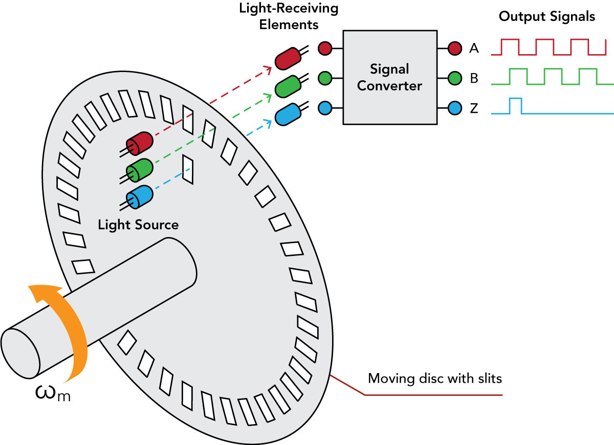
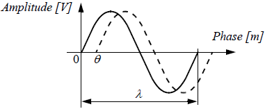
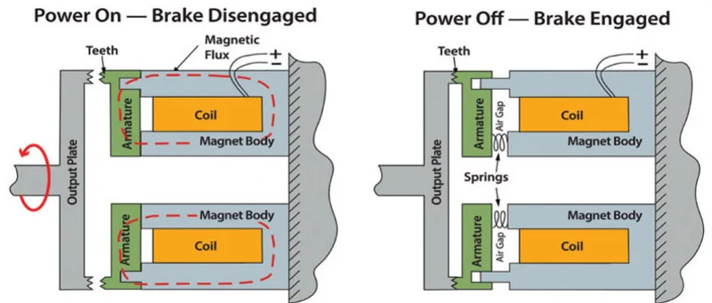
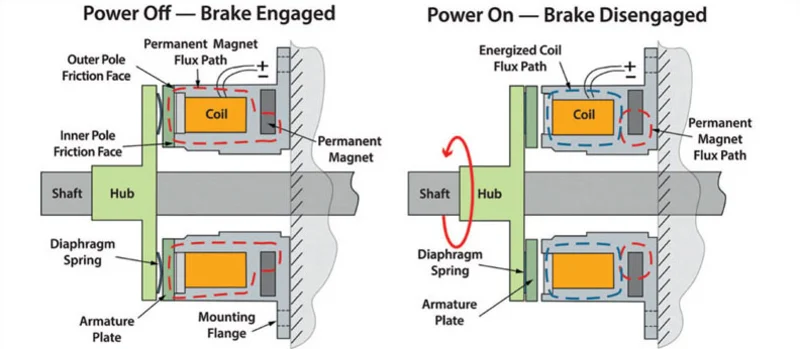

<!-- _class: titlepage -->

# Percepción y actuación sobre el entorno

## Robótica

### Alberto Díaz Álvarez y Raúl Lara Cabrera

#### Departamento de Sistemas Informáticos - Universidad Politécnica de Madrid

##### 11 de junio de 2023

---

# Introducción

Independientemente del tipo de robot, todos ellos deben ser capaces de:

- Recibir información del entorno o de sí mismos, es decir, percibir
- Actuar sobre el entorno o sobre sí mismos, es decir, actuar

En este tema veremos los sensores y actuadores más comunes en robótica.

- Y ahondaremos en el área de la visión artificial como mecanismo de percepción

---

# Percepción<!-- _class: section -->

---

# Percepción

Para realizar sus tareas, lo primero que necesita un robot es:

1. Tener conocimiento del **entorno** en el que se encuentra
1. Conocer también su propio **estado interno**

Un **sensor** toma medidas (o señales) y las procesa para extraer información:

- No es raro; los seres vivos usamos sensores para movernos por el entorno.

  

---

# Clasificación de los sensores

Vamos a clasificar los sensores en función de dos ejes/características:

### Según magnitud medida

_Propioceptivos_ o internos

Velocidad del motor, voltaje de la batería, ...

_Exteroceptivos_ o externos

Distancia a objeto, intensidad de la luz, amplitud del sonido, ...

### Mecanismo de medición

_Pasivos_

Miden la energía ambiental que entra en el sensor.

_Activos_

Emiten energía al entorno y miden la respuesta del entorno.

---

# Magnitudes físicas medidas

Típicamente, las magnitudes internas y del entorno son las siguientes:

- Distancia 
- Humedad
- Luz
- Magnetismo
- Posición

- Presión y/o fuerza
- Sonido
- Temperatura
- Velocidad

Las medidas **pueden ser indirectas**, para obtener información adicional

---

# Rendimiento de los sensores

**Rango dinámico**: Relación entre los valores máximo y mínimo que puede tomar un determinado valor. Se mide en decibelios ($dB$):

$$
DR_P=10\cdot\log\left [\frac{P_{MAX}}{P_{MIN}} \right], DR_V=20\cdot\log\left [\frac{P_{MAX}}{P_{MIN}} \right]
$$

**Resolución**: Diferencia mínima entre dos valores de medida del sensor.

**Frecuencia** o **ancho de banda**: Velocidad a la cual el sensor es capaz de proporcionar lecturas. Se mide en hertzios ($Hz$).

**Sensibilidad**: Cambio que debe ocurrir en la medida para que el sensor cambie su salida.

---

**Linealidad**: Medida importante que determina el comportamiento de la señal de salida del sensor al variar la señal de entrada:

**Error**: Diferencia entre las mediciones de salida del sensor y los valores reales que se miden.

---

# Sensores de posición

<!-- _class: cool-list -->

1. _Sensores de motores/ruedas_
2. _Sensores de dirección_
3. _Acelerómetros_
4. _Unidad de medida inercial_
5. _Ground beacons_

---

# Sensores de motores/ruedas: <i>Encoders</i>

Son **propioceptivos pasivos** y cuentan con:

1. Disco (o tira) con un patrón
1. Emisor de luz
1. Receptor óptico

Si el disco gira se genera un tren de pulsos cuyo conteo determina la posición.

- Una segunda franja de marcas desplazada permite conocer el sentido de giro
- Una marca única de referencia permite conocer su posición inicial

---

Su resolución depende directamente del número de marcas del disco.

- Cada pulso son dos lecturas: flanco de subida y flanco de bajada

Los más comunes son los de tipo **incrementales**

- El conteo se realiza en cada flanco de subida y bajada
- Una vez se llega al marcador de posición, se reinicia el conteo

Existen también los codificadores **absolutos**

- Cada marca se dispone según un código binario cíclico (normalmente Gray)
- Las resoluciones son potencias de 2
- No necesita mecanismos adicionales para conocer el sentido o la posición

---

<video controls width=100% src="https://drive.upm.es/s/N0cAEdHt2jXRyJF/download"></video>

---

# Sensores de motores/ruedas: <i>Resolvers</i>

Son sensores analógicos formados por dos partes:

1. Estator: Parte fija con bobinas que miden velocidad y posición de giro
1. Rotor: Parte móvil que genera un campo eléctrico que capta el estator

Al ser analógicos, su resolución es teóricamente infinita.

---

<video controls width=100% src="https://drive.upm.es/s/A5kAbxbWpFu0xSE/download"></video>

---

# Sensores de motores/ruedas: Potenciómetros

Los **potenciómetros** son muy similares a los <i>resolvers</i>

- En este caso usan una resistencia con un contacto móvil rotatorio o deslizante
- Los movimientos de un eje cambiarán el voltaje de salida del potenciómetro.

Dan muy bajas prestaciones

- Se suelen emplear en proyectos educativos

---

# Sensores de dirección

Los **giroscopios** son sensores de dirección que conservan su orientación en relación con un marco de referencia fijo.

Proporcionan una medida absoluta de la dirección de un sistema móvil.

Se trata de un sensor *propioceptivo pasivo*.

---

# Sensores de dirección

Una **brújula** nos permite determinar la orientación del robot.

Dos tecnologías:

- **Efecto Hall**: el voltaje de salida es proporcional a la magnitud del campo magnético que lo atraviesa.
- **<i>Flux gate</i>**: dos o más pequeñas bobinas de alambre alrededor de un núcleo de material magnético altamente permeable, para detectar directamente la dirección de la componente horizontal del campo magnético terrestre.

---

# Acelerómetros

Un **acelerómetro** es un dispositivo usado para medir todas las fuerzas externas que actúan sobre él.

Conceptualmente, un **acelerómetro** es una masa unida a un muelle.

Cuando se produce una aceleración, la masa se desplaza hasta el punto en el que el muelle iguala la velocidad de desplazamiento de la carcasa.

Midiendo la extensión del muelle se obtiene la aceleración.

---

# Unidad de medida inercial

Una **<i>inertial measurement unit (IMU)</i>** es un dispositivo que combina giroscopios y acelerómetros para estimar la posición relativa, velocidad y aceleración de un robot móvil.

Un **IMU** estima los seis grados de libertad del vehículo: posición (x, y, z) y orientación (<i>pitch</i>, <i>yaw</i>, <i>roll</i>).

También se le conoce como <i>inertial navigation system (INS)</i>

---

# Ground beacons

Un enfoque elegante para resolver el problema de la localización en la robótica móvil es utilizar **balizas** activas o **balizas** pasivas.

Mediante la interacción de los sensores de a bordo y las **balizas** del entorno el robot puede identificar su posición con precisión.

El sistema de balizas más usado en la actualidad es el **Global Positioning System (GPS)**.

Cuando un receptor GPS lee la transmisión de dos o más satélites, las diferencias de tiempo de llegada informan al receptor sobre su distancia relativa a cada satélite.

Al combinar la información sobre la hora de llegada y la ubicación instantánea de cuatro satélites, el receptor puede inferir su propia posición.

---

# Sensores activos de alcance

Los **sensores de alcance** ofrecen mediciones directas de la distancia entre el robot y los objetos de su entorno.

<!-- _class: cool-list -->

1. *Sensores ultrasónicos*
1. *Sensores láser*
1. *Cámaras <i>time-of-flight</i>*
1. *Sensores de triangulación óptica*
1. *Sensores de luz estructurada*

---

# Sensores ultrasónicos

El principio básico de un **sensor ultrasónico** es transmitir un paquete de ondas de presión (ultrasónicas) y medir el tiempo que tarda este paquete de ondas en rebotar y volver al receptor.

La distancia $d$ al objeto que causa el rebote se puede calcular en función de la velocidad $c$ de propagación del sonido y el tiempo $t$ desde que se emite hasta que se recibe el eco

$$
d=\frac{c\cdot t}{2}
$$

---

# Sensores láser

Este tipo de sensor consta de un transmisor que ilumina un objetivo con un haz colimado (por ejemplo, un láser), y un receptor capaz de detectar la componente de la luz, que es esencialmente coaxial con el haz transmitido.

A menudo denominados **radar óptico** o **LIDAR (light detection and ranging)**, estos dispositivos producen una estimación del alcance basada en el tiempo necesario para que la luz alcance el objetivo y regrese.

En realidad, se mide la diferencia de fase entre la luz emitida y la reflejada.

---

<video controls width=100% src="https://drive.upm.es/s/XXYAnKdVKNMVd1r/download"></video>

---

# Cámaras <i>time-of-flight</i>

Una **cámara <i>time-of-flight</i>** es un sensor de alcance muy similar al láser con la excepción de que mide la distancia a cada uno de los píxeles de la imagen capturada en lugar de hacer un barrido con el láser.

Este dispositivo utiliza una fuente de iluminación infrarroja modulada para determinar la distancia para cada píxel de un dispositivo mezclador fotónico.

Se realizan dos capturas consecutivas, la segunda sin iluminación infrarroja para determinar la luz de relleno de la escena.

---

# Sensores de triangulación óptica

Estos sensores usan propiedades geométricas de su estrategia de medición para establecer la distancia a los objetos.

Se proyecta un haz colimado hacia el objetivo. La luz reflejada se recoge por una lente y se proyecta sobre una cámara lineal.

---

# Sensores de luz estructurada

El funcionamiento de los sensores de luz estructurada se basa en la proyección de un haz de luz con un patrón predeterminado (luz estructurada).

Analizando la deformación que sufre el patrón al reflejarse en el objeto se determina la distancia y morfología del mismo.

---

<video controls width=100% src="https://drive.upm.es/s/2FtZidXVjaU7VY6/download"></video>

---

# Actuación<!-- _class: section -->

---

# Definición y tipos de actuadores

Dispositivos electromecánicos que **convierten energía en trabajo mecánico**.

- Trabajo mecánico: **Energía** que modifica el **movimiento** de un objeto.
- Es decir, puede ser para inducir u oponerse al movimiento de algo.
- La mayoría obtiene la energía de electricidad o presión de aire/fluidos.

Hay diferentes tipos de actuadores disponibles y la mayoría de ellos crean:

- Movimiento **lineal**
- Movimiento **rotacional**

El movimiento oscilatorio también es posible, pero es menos común.

---

# Actuadores neumáticos

Utilizan **aire comprimido** para moverse.

Son muy rápidos, tienen una alta fuerza de empuje, fáciles de de controlar y son muy precisos. Además, son muy fáciles de instalar y muy baratos.

Constan de un cilindro, un pistón, un diafragma, y un muelle.

El aire comprimido se introduce en el cilindro a través del diafragma, y el pistón se mueve hacia adelante. Cuando el aire se libera, el muelle empuja el pistón hacia atrás.

---

<video controls width=100% src="https://drive.upm.es/s/B9HKKWPHI4DjWHZ/download"></video>

---

# Actuadores hidráulicos

Utilizan **fluidos** para moverse.

Son más lentos que los actuadores neumáticos, pero tienen una alta fuerza de empuje. Comparten el resto de ventajas con los actuadores neumáticos.

El funcionamiento y los componentes son similares a los actuadores neumáticos.

Se utilizan principalmente para sistemas que requieren **una fuerza muy grande** (e.g. brazo de retroexcavadora), pero no muy restrictiva en cuanto a posicionamiento y precisión.

---

# Actuadores eléctricos

Utilizan **electricidad** para generar el movimiento.

- _Actuadores de efecto hall_: basados en el efecto hall (campo magnético al pasar una corriente a través de un conductor). **Fuerzas pequeñas**, pero con una **alta precisión**.

- _Actuadores de efecto magnético_: basados en el efecto magnético, que produce una fuerza sobre un conductor cuando se le aplica un campo magnético. **Fuerzas grandes**.

- _Actuadores de efecto piezoeléctrico_: basados en el efecto piezoeléctrico, que produce un cambio de forma en un cristal cuando se le aplica una tensión eléctrica. **Fuerzas muy pequeñas**, pero con una **alta precisión**.

---

# Solenoides

Utilizan el **efecto magnético** para moverse.

El solenoide está formado por una bobina y un núcleo ferroso móvil que convierte la energía eléctrica en energía mecánica creando un movimiento lineal.

Cuando la electricidad fluye a través de una bobina, crea un campo magnético y tira del pistón ferroso (de hierro o acero) hacia ella. Se pueden utilizar varias bobinas para devolver el pistón a su posición original.

---

<video controls width=100% src="https://drive.upm.es/s/X2ufUyH91LLECDE/download"></video>

---

# Motores eléctricos

Se basan en el **principio del electromagnetismo**.

Se compone de un **rotor** y un **estator**. El **rotor** es un electro-imán móvil que gira alrededor del eje del motor. El **estator** es un conjunto de imanes fijos que rodean al rotor.

Cuando se aplica una corriente eléctrica al rotor, se crea un campo magnético que provoca que el rotor gire alrededor del eje del motor.

La fuerza de empuje del rotor se puede controlar variando la intensidad de la corriente.

---

# Clasificación de motores eléctricos

No veremos todos, sino únicamente lo más relevantes

---

# Motores de corriente alterna (AC)

Motores eléctricos que utilizan corriente alterna para funcionar.

Se clasifican según el número de fases:

- **Monofase**: Una única fase
- **Multifase**: dos o más fases (los más usados en la industria son de tres fases).

Inventados por Nikola Tesla, son **más fáciles de controlar** que los de corriente continua, pero **más caros** y **menos eficientes**.

---

# Motores de corriente continua (DC)

Motor rotativo que convierte la energía eléctrica continua en energía mecánica.

Casi todos los tipos de motores de corriente continua tienen algún mecanismo interno, electromecánico o electrónico, para cambiar periódicamente la dirección de la corriente en una parte del motor.

La velocidad de un motor de corriente continua puede controlarse en un amplio rango, utilizando una tensión de alimentación variable o cambiando la intensidad de la corriente en sus bobinas de campo.

---

# Motores DC de escobillas

En un motor de corriente continua con escobillas, el rotor tiene imanes permanentes y el estator tiene electroimanes.

Como el motor necesita una forma de detectar la orientación del rotor, utiliza escobillas como conmutador, que es una pieza del rotor que toca el eje.

Cuando el rotor gira (a su vez, la escobilla gira), detecta el cambio de orientación e invierte la corriente.

Estos motores pueden girar a velocidades muy altas, pero con un torque muy bajo. Podemos mejorar el torque conectando el rotor a un reductor (sistema de engranajes).

---

# Motores DC sin escobillas

En un motor sin escobillas, el rotor es de imán permanente y el estator es de electroimán.

Para detectar un cambio de orientación, los motores sin escobillas suelen utilizar sensores de efecto Hall para detectar el campo magnético del rotor y consecutivamente su orientación.

Los motores sin escobillas son muy útiles en los robots, ya que son más capaces; proporcionan un par suficiente, y mayores velocidades que los motores con escobillas.

Los motores sin escobillas son caros debido a la complejidad de su diseño y necesitan un controlador para controlar su velocidad y rotación.

---

<video controls width=100% src="https://drive.upm.es/s/RzeukxzUBitlS2X/download"></video>

---

# Servomotores

Motores de corriente continua acoplados a:

- Circuito de control de retroalimentación.
- Sistema de engranajes para aumentar el par.
- Dispositivo de detección de posición (normalmente un potenciómetro).

Al recibir una señal (pulso de control), el eje se desplaza hasta la posición indicada utilizando la retroalimentación de posición de un potenciómetro.

**No presentan rotación continua**:

- Están limitados a un rango específico (generalmente ±200°).

Poseen tres cables: tierra, potencia y **pulso de control**.

---

<video controls width=100% src="https://drive.upm.es/s/aKLcTvC2C60vRrZ/download"></video>

---

# Motores paso a paso

Motor eléctrico de **corriente continua sin escobillas** que divide una rotación completa en un número de pasos iguales.

La posición del motor puede controlarse para que se mueva y se mantenga en uno de estos pasos sin ningún sensor de posición.

Son **muy precisos** y tienen un **par de torsión muy alto**, pero son más **lentos** que los servos.

Debido a su precisión, se usan en aplicaciones como impresoras 3D, máquinas de coser, máquinas de grabado láser, etc.

---

<video controls width=100% src="https://drive.upm.es/s/18iIU40iVRL2FBY/download"></video>

---

# Motores lineales

Motor eléctrico al que se le ha "desenrollado" el estator y el rotor, por lo que, en lugar de producir un par (rotación), produce una fuerza lineal a lo largo de su longitud.

**No son necesariamente rectos**. La sección activa de un motor lineal suele tener extremos, mientras que los motores más convencionales están dispuestos en forma de bucle continuo.

Suelen emplearse en aplicaciones de alta precisión.

---

<video controls width=100% src="https://drive.upm.es/s/peejQ4o8X1CSGZL/download"></video>

---

# LED (Light-Emitting Diode)

Dispositivo semiconductor que emite luz cuando se le aplica una tensión.

Se puede utilizar para indicar el estado de un robot, iluminar el entorno, etc.

Algunos pueden emitir una luz de color diferente, dependiendo de la tensión aplicada. Lo normal es que emitan luz del mismo color.

Dado que pueden alternar su estado millones de veces por segundo **pueden usarse como** un **mecanismo de comunicación** con un elevado ancho de banda.

---

# Pantalla LCD

Una pantalla LCD es un dispositivo que muestra información en una pantalla de cristal líquido.

Son muy populares en los robots, ya que son baratas, fáciles de usar y tienen un alto contraste.

Las pantallas LCD se pueden usar para mostrar información, como el estado de un robot, el tiempo restante, etc.

Las últimas pantallas LCD son táctiles, lo que permite al usuario interactuar con el robot. Además tienen resoluciones muy altas y son capaces de mostrar imágenes y vídeos en color.

---

# Dispositivos de frenado

Los frenos más comúnmente utilizados en aplicaciones robóticas se pueden clasificar como de **muelle** o de **imán permanente**. Además, los frenos de muelle se clasifican como **frenos de disco** o **frenos dentados**.

Dependiendo del estado del freno, la bobina atrae o repele el mecanismo de fricción

 

> Fuente: TechBriefs.com

---

<video controls width=100% src="https://drive.upm.es/s/f6bq2GPB4lonH75/download"></video>

---

<video controls width=100% src="https://drive.upm.es/s/Vn629GTVxvfaZyB/download"></video>

---

# Dispositivos de frenado

En el caso de los imanes permanentes, el freno se activa cuando el imán se acerca al mecanismo de fricción.

El movimiento se controla con una bobina que provoca un campo magnético.

> Fuente: TechBriefs.com

---

<video controls width=100% src="https://drive.upm.es/s/awhSAUpepf5EIwI/download"></video>

---

# Músculos artificiales

Dispositivos (o materiales) que imitan el músculo natural:

- Dado un estímulo externo, pueden cambiar su rigidez, expansión/contracción o su torsión
- También denominados **actuadores de tipo muscular**

Las **tres respuestas básicas** (contracción, expansión y rotación) pueden **combinarse** dentro de un mismo componente **para producir otros movimientos** (e.g. la flexión, contrayendo un lado del material mientras se expande el otro).

---

<video controls width=100% src="https://drive.upm.es/s/3kg5fadUeha4CeQ/download"></video>

---

# Actuadores disponibles en Webots

Webots provee de abstracciones de estos y otros actuadores, por ejemplo:

- [Altavoz](https://cyberbotics.com/doc/reference/speaker): Simula emisión de sonido
- [Bolígrafo](https://cyberbotics.com/doc/reference/pen): Simula un dispositivo de pintado
- [Emisor](https://cyberbotics.com/doc/reference/emitter): Simula envío de datos a través de radio, serie o infrarrojos
- [Freno](https://cyberbotics.com/doc/reference/brake): Simulación de frenado mecánico
- [Hélice](https://cyberbotics.com/doc/reference/propeller)
- [LED](https://cyberbotics.com/doc/reference/led)
- [Motor lineal](https://cyberbotics.com/doc/reference/linearmotor)
- [Motor rotativo](https://cyberbotics.com/doc/reference/rotationalmotor)
- [Muśculo](https://cyberbotics.com/doc/reference/muscle): Simula un músculo artificial
- [Pantalla](https://cyberbotics.com/doc/reference/display)

---

# ¡GRACIAS!<!--_class: endpage-->
