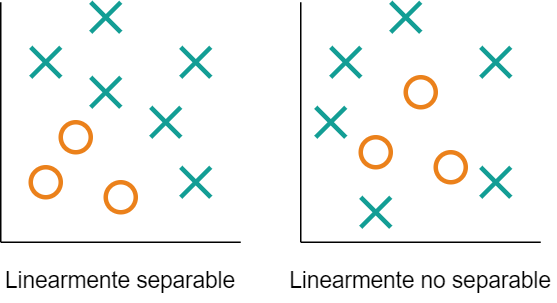
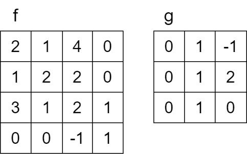
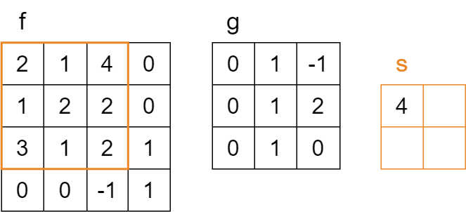
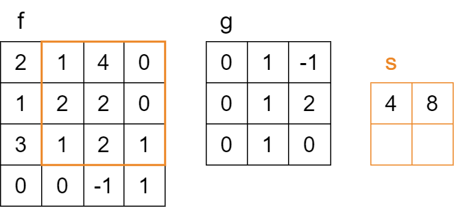
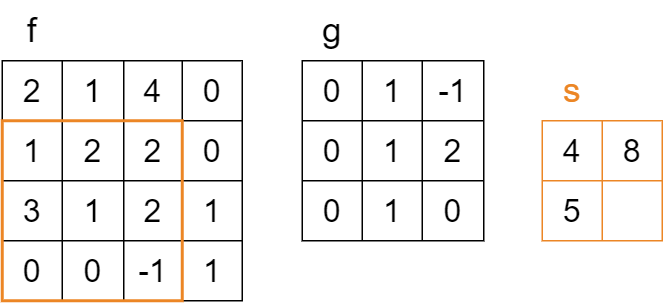
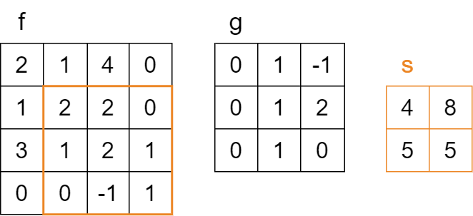
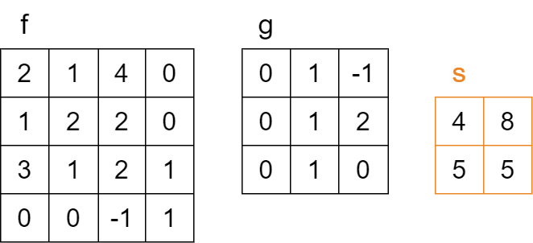
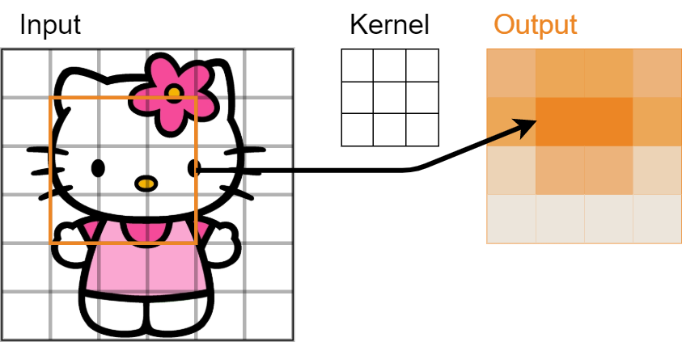
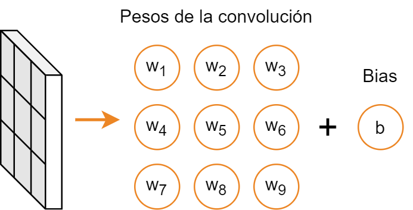

<!-- _class: titlepage -->

# Deep learning en visión

## Robótica - Grado en Ingeniería de Computadores

### Departamento de Sistemas Informáticos

#### E.T.S.I. de Sistemas Informáticos - Universidad Politécnica de Madrid

---

# Neurona biológica vs. artificial

Sistema matemático capaz de realizar predicciones a partir de datos de entrada

- Propuesta por McCulloch y Pitts en 1943
- Basada en _imitar_ el comportamiento de una neurona biológica
- Toma ciertos _estímulos_ de entrada, los procesa y genera una nueva salida

## Neurona biológica

- Estímulos $\rightarrow$ _impulsos nerviosos_

<figcaption align="center">

**Fig.1** - Neurona biológica. Fuente: [Wikipedia](https://commons.wikimedia.org/wiki/File:Neuron3.png).

</figcaption>

## Neurona artificial

- Estímulos $\rightarrow$ _cálculos matemáticos_

<figcaption align="center">

**Fig.2** - Neurona artificial. Fuente: [Wikipedia](https://commons.wikimedia.org/wiki/File:Artificial_Neuron.svg).

</figcaption>

---

# Neurona artificial

<figcaption align="center">

</figcaption>

**Fig.3** - Neurona artificial. Fuente: [Kim and Bak, 2025](https://www.mdpi.com/2079-9292/14/23/4718).

Para ello, existen diversos _elementos_ dentro de una neurona artificial:

- **Entradas** ($x_i$): Los valores numéricos de entrada
- **Salida** ($y$): El valor de salida de la neurona
- **Pesos** ($w_i$): Parámetros capaces de cambiar, suponen el aprendizaje de la neurona
- **Bias** ($b$): Peso cuya entrada _siempre_ es $1$ y que desplaza la función de activación
- **Función de activación**: $a$: Participa en el cálculo de la salida de la neurona

</figcaption>

---

# Inferencia o propagación

Se encarga de procesar la _entrada_ y generar la _salida_ correspondiente

1. Cada entrada $x_i$ es multiplicada por el valor de su peso correspondiente $w_i$,
   - La entrada del <i>bias</i> siempre es $1$, y tiene su propio peso (denominado $w_0$ o $b$)
2. Todos los productos se suman (**entrada neta**),
3. La entrada neta pasa por la función de activación $a$ para generar la salida $\hat{y}$.

Cuando hay varias capas, **la salida de una capa es la entrada de la siguiente**

---

# Estructura de capas

Las redes de neuronas se suelen organizar por capas

- Éstas se componen de varias neuronas
- Cuando cada neurona de una capa se conecta con todas las de la siguiente, se denomina **capa densa** o **fully connected**
- Si la red posee sólo capas densas se denomina perceptrón multicapa (MLP)

<figcaption align="center">

**Fig.4** - Esquema de un perceptrón multicapa. Fuente: [AILephant](https://ailephant.com/glossary/multilayer-perceptron/).

</figcaption>

---

# ¿Por qué introducir más capas?

Está matemáticamente **demostrado** que sin función de activación las redes de neuronas sólo son capaces de resolver problemas **linealmente separables**.

Esto es fácilmente demostrable, ya que la computación de cada neurona corresponde con la ecuación de **una recta**, y su combinación también.

Por otra parte, K. Hornik, M. Stinchcombe y H. White demostraron en 1989 que con **una única capa oculta** las redes neuronales artificiales se convierten en aproximadores universales (Hornik et al., 1989).

---

# Funciones de activación

Las **funciones de activación** de cada neurona pueden variar; algunas de las más populares son:

<figcaption align="center">

**Fig.5** - Algunas funciones de activación. Fuente: [Johnson et al. 2020](https://www.researchgate.net/publication/341310767_Machine_Learning_for_Materials_Developments_in_Metals_Additive_Manufacturing).

</figcaption>

---

# Cómo crear una red de neuronas artificial en Python

Para el desarrollo de la asignatura, utilizaremos las librerías de [Tensorflow](https://www.tensorflow.org/) y [Keras](https://keras.io/), aunque existen otras alternativas populares como [PyTorch](https://pytorch.org/).

En el notebook *Clase_Keras_Sequential_vs_Functional.ipynb* veremos cómo crear nuestra primera red de neuronas en Keras. Eso sí, aún no haremos nada con ella.

---

# Función de error (pérdida o <i>loss</i>)

Se usa para calcular el error entre salida deseada y real

- Para un ejemplo: _coste_ (<i>coste</i>); para muchos: _pérdida_ (<i>loss</i>),

<figcaption align="center">

**Fig.6** - Entropía cruzada (clasificación). Fuente: [Datamonje](https://datamonje.com/classification-loss-functions/).

</figcaption>

<figcaption align="center">

**Fig.7** - Ejemplos de <i>loss</i> en regresión. Fuente: [StatLect](https://www.statlect.com/glossary/loss-function).

</figcaption>

---

# Algoritmo de retropropagación (<i>backpropagation</i>)

Es el encargado de _adaptar_ la red de neuronas a su cometido específico

$$
\begin{equation}
    \bigtriangleup w_i = w_i - \alpha \cdot \delta_i
\end{equation}
$$

- $\delta_i$ es directamente proporcional al _loss_ en la última capa
- $\delta_i$ es directamente proporcional al error de la capa inmediatamente posterior
  - De ahí lo de retropropagación, el error se va propagando de la última a la primera capa
- Para calcular la dirección del error se usa el gradiente de la función de activación

---

# Entrenamiento

Entrenamiento en un esquema de aprendizaje supervisado:

1. **Inferencia**: Se calcula la salida de la red para una entrada,
2. **Calculo del error**: Se comparan las salidas real y deseada,
3. **Retropropagación**: Se modifican los pesos según el error.

Esta operación se realiza iterativamente hasta que el error sea lo suficientemente bajo

- Cada iteración se denomina **época** o <i>epoch</i> y es una vuelta a todo el conjunto de entrenamiento
- A cada porción de datos de entrenamiento se le denomina **lote** o <i>batch</i>

<figcaption align="center">

**Fig.8** - Neurona artificial. Fuente: [XKCD](https://xkcd.com/2173/).

</figcaption>

---

# Entrenamiento de redes neuronales

Durante la creación de modelos, se suelen usar tres conjuntos de datos:

- **Entrenamiento** (<i>training</i>): Usado para entrenar el modelo,
- **Validación** (<i>validation</i>): Usado para validar el modelo **durante el entrenamiento**,
  - Suele ser un subconjunto del conjunto de entrenamiento
- **Testeo** (<i>testing</i>): Usado para probar el modelo una vez entrenado.
  - Debe ser un conjunto de datos no visto por el modelo durante el entrenamiento

<figcaption align="center">

**Fig.9** - Representación de los conjuntos de entrenamiento, validación y test. Fuente: [Towards Data Science](https://towardsdatascience.com/train-validation-and-test-sets-72cb40cba9e7).

</figcaption>

---

# Compromiso sesgo-varianza

En inglés <i>bias-variance tradeoff</i>, es el equilibrio entre dos tipos de error:

- **Sesgo** (<i>bias</i>): Error por supuestos demasiado simples (<i>underfitting</i>)
- **Varianza** (<i>variance</i>): Error por excesiva sensibilidad a los datos (<i>overfitting</i>)

Modelos y complejidad:

- **Modelo simple**: Puede no capturar las relaciones subyacentes en los datos
- **Modelo complejo**: Puede sobreajustarse, capturando ruido y anomalías

Implicaciones:

- **Sobreajuste** (<i>overfitting</i>): Modelos muy complejos con alta varianza
- **Subajuste** (<i>underfitting</i>): Modelos muy simples con alto sesgo
- Objetivo: Equilibrio donde el modelo es lo _suficientemente flexible_ para capturar la verdadera relación, pero no tanto como para ser engañado por el ruido

---

# ¿Cómo detectar altos sesgo o varianza?

## Detección de un alto sesgo:

- **Indicador**: Error elevado en entrenamiento
- **Soluciones**: Aumentar complejidad, más épocas, revisar arquitectura y calidad de datos.

## Deteción de una alta varianza:

- **Indicador**: Gran diferencia entre errores de entrenamiento y validación
- **Soluciones**: Más datos, usar regularización (ej. dropout), disminuir complejidad, aumentado de datos

---

# Problemas del gradiente<!-- _class: section -->

---

# Recordando qué es el gradiente

Vector que indica la dirección y magnitud de máximo crecimiento de una función

- En redes neuronales nos dice **cómo actualizar los pesos para minimizar el error**
- Se obtiene al derivar la función de <i>loss</i> respecto a cada peso
  - Así sabemos cuánto cambiaría la función de pérdida si ajustáramos un peso específico

<figcaption align="center">

**Fig.10** - Gradiente calculándose para varios pesos y su evolución a lo largo de $10$ iteraciones. Fuente: [Towards AI](https://pub.towardsai.net/deep-learning-from-scratch-in-modern-c-gradient-descent-670bc5889112).

</figcaption>

---

# Problema del desvaniecimiento del gradiente

Ocurre cuando los **gradientes** de las capas más alejadas a la entrada **tienden a disminuir exponencialmente** a medida que se retropropagan a través de la red

- Provoca actualizaciones mínimas, más cuanto más cercanas a la entrada
- Aprendizaje lento o nulo: Las capas profundas no convergen (o sí, pero muy lento)
- Mayor cuanto más capas (multiplicación continua de valores pequeños)

La principal causa es la naturaleza de ciertas funciones de activación

sigmoid</i> o <i>tanh</i> comprimen un amplio rango de valores de entrada a un rango limitado, resultando en derivadas muy pequeñas" height="200px">
<figcaption align="center">

**Fig.11** - La sigmoide comprime muchos valores de entrada a un rango limitado. Fuente: [Towards Data Science](https://towardsdatascience.com/derivative-of-the-sigmoid-function-536880cf918e).

</figcaption>

---

# Problema de la Explosión del Gradiente

Ocurre cuando los **gradientes** se vuelven **excesivamente grandes**, causando actualizaciones de pesos desproporcionadas, haciendo que la red sea inestable

- Es el fenómeno opuesto al desvanecimiento del gradiente
- Actualizaciones inestables, red que oscila y no converje, o incluso que diverje a infinito
- Riesgo de Overfitting: La red puede adaptarse demasiado a particularidades del conjunto de entrenamiento.
- Valores NaN: Las actualizaciones excesivas pueden llevar a valores numéricos indeseados o no válidos en la red.

> A diferencia del desvanecimiento del gradiente, donde el aprendizaje se detiene, la explosión del gradiente puede hacer que la red aprenda patrones incorrectos o simplemente falle.

---

# Soluciones a los problemas del gradiente

Algunas soluciones son de diseño o de parametrización:

- **Funciones de activación**: Optar por funciones como ReLU o sus variantes (Leaky ReLU, Parametric ReLU) que no saturan en regiones extensas
- **Inicialización de pesos**: Utilizar técnicas como la inicialización He o Xavier/Glorot, que consideran el tamaño de las capas anteriores y siguientes.
- **Optimizadores Avanzados**: Como Adam, RMSprop o Adagrad, que ajustan dinámicamente las tasas de aprendizaje.

Otras son ya técnicas específicas de estos problemas

- **Gradient Clipping**: Establece un umbral para limitar el tamaño del gradiente
- **Batch Normalization**: Normaliza la activación de las neuronas dentro de una capa para mantenerlas en un rango deseado.

---

# Perceptrón multicapa para procesar imágenes<!-- _class: section -->

---

# ¿Cómo procesar imágenes?

Las imágenes son matrices, pero las redes neuronales trabajan con vectores

- Así que no nos queda otra que _aplanar_ la imagen en un vector unidimensional

<figcaption align="center">

**Fig.12** - La entrada al perceptrón debe ser pasada a vector antes de ser procesada. Fuente: [Towards Data Science](https://towardsdatascience.com/the-most-intuitive-and-easiest-guide-for-convolutional-neural-network-3607be47480).

</figcaption>

En `keras` existe la capa `Flatten` precisamente para realizar esta operación

---

# Implementando un perceptrón multicapa

En el notebook *Clasificación_de_dígitos_con_un_perceptrón_multicapa.ipynb* se muestra un ejemplo de clasificador de imágenes usando un perceptrón multicapa como red neuronal.

---

# Problemas del perceptrón

Al transformar la matriz en vector **se pierde la información espacial** de la imagen

- En particular, todas las relaciones de _color_ y _distancia_

<figcaption align="center">

**Fig.13** - Aplanar una imagen hace que perdamos su información espacial. Fuente: [Suraj Yadav (Medium)](https://medium.com/@Suraj_Yadav/in-depth-knowledge-of-convolutional-neural-networks-b4bfff8145ab).

</figcaption>

Y también está la **enorme magnitud de las redes** creadas de esta manera

- Ejemplo: Imagen de $512\times512$ píxeles $\rightarrow$ ¡$786.432$ neuronas de entrada!

---

# Fundamentos de las redes convolucionales<!-- _class: section -->

---

# Redes convolucionales

Las redes neuronales convolucionales surgen para adaptar las redes neuronales al tratamiento de imágenes.

Los principales beneficios de su uso son los siguientes:
- Aprovechamiento de la información espacial.
- Reducción del número de parámetros.
- Invarianza aprendida de los datos.

---

# Operación de convolución

Las redes **convolucionales** son redes adaptadas al **tratamiento de imágenes**

- Y se apoyan en la **convolución**, que es el producto punto entre dos matrices

<figcaption align="center">

**Fig.13** - Operación de convolución aplicada a una imagen. Fuente: [IceCream Labs](https://icecreamlabs.medium.com/3x3-convolution-filters-a-popular-choice-75ab1c8b4da8).

</figcaption>

Para ello deben existir dos elementos fundamentales:

- Imagen de entrada: Matriz tridimensional de datos
- Filtro o <i>kernel</i>: Matriz con la que realizar la operación de _convolución_

---

# Operación de convolución

La salida se calcula haciendo una combinación lineal de cada región de la imagen. De esta manera la salida contiene la activación de cada zona de la imagen.

Esta región que el *kernel* es capaz de observar se conoce como campo receptivo.

---

# Operación de convolución

<figcaption align="center">

Resultado de una convolución sobre una matriz de datos

</figcaption>

---

# Operación de convolución

<figcaption align="center">

Resultado de una convolución sobre una matriz de datos

</figcaption>

---

# Operación de convolución

<figcaption align="center">

Resultado de una convolución sobre una matriz de datos

</figcaption>

---

# Operación de convolución

<figcaption align="center">

Resultado de una convolución sobre una matriz de datos

</figcaption>

---

# Operación de convolución

<figcaption align="center">

Resultado de una convolución sobre una matriz de datos

</figcaption>

---

# Operación de convolución

<figcaption align="center">

Resultado de una convolución sobre una matriz de datos

</figcaption>

---

# Campo receptivo

La salida de la convolución es una _extracción de características_ de la imagen

<figcaption align="center">

**Fig.14** - Extracción de características asociadas a un filtro concreto.

</figcaption>

El **campo receptivo** de cada celda de salida se **activa** al detectar la **característica**

- Diferentes filtros detectarán diferentes características

---

# ¿Y qué aprende la red?

Una red de convolución sustituye las primeras capas **densas** por **convolucionales**

- El bloque convolucional extrae características
- El bloque denso predice de acuerdo a características, (y no a píxeles en bruto)

Cada capa convolucional está compuesta por una serie de filtros de igual tamaño

<figcaption align="center">

**Fig.15** - Los pesos de las capas de convolución son los filtros.

</figcaption>

La red aprenderá qué filtros extraen las características para el problema a resolver

---

# Tamaño de la salida de una capa convolucional

Supongamos que tenemos:

- Una imagen de entrada de $n \times m$ píxeles y $c$ canales,
- Un filtro de $f \times g$ píxeles,
- Una capa de convolución con $k$ filtros,

Entonces la salida de la capa convolucional será de:

$$
\begin{equation}
  (n - f + 1) \times (m - g + 1) \times k
\end{equation}
$$

La salida es una nueva imagen **más pequeña** de las características extraídas

---

# Padding en la convolución

Muchas convoluciones reducen el tamaño de la imagen de salida

- Lo que es un problema en redes muy profundas

¿Cómo se soluciona? Con un relleno de ceros (<i>padding</i>) en la imagen de entrada

- Filtro de $n \times m$ $\rightarrow$ $\lfloor n/2 \rfloor$ arriba y abajo, $\lfloor m/2 \rfloor$ derecha e izquierda

<figcaption align="center">

**Fig.16** - Los pesos de las capas de convolución son los filtros.

</figcaption>

Así la imagen de **salida** tendrá el **mismo tamaño** que la de **entrada**

---

# Salto (<i>stride</i>) en la operación de convolución

Un <i>stride</i> es el número de píxeles que se desplaza el filtro al realizar la convolución

- No tienen por qué coincidir ambos desplazamientos (y por defecto son $1$)

La fórmula de la dimensión cuando hay:

- Una **dimensión** de entrada de $n$ píxeles,
- Un **filtro** de $f$ píxeles,
- Un **salto** de $s$ píxeles,
- Un **padding** de $p$ píxeles

Es la siguiente:

$$
\frac{n - f + 2p}{s} + 1
$$

<figcaption align="center">

**Fig.17** - Filtro de $3 \times 3$ con desplazamiento de $3$ en ambas direcciones. Fuente: [The Startup](https://medium.com/swlh/convolutional-neural-networks-part-2-padding-and-strided-convolutions-c63c25026eaa)
</figcaption>

---

# Reducción dimensional en redes convolucionales

La operación principal para ello es el <i>pooling</i>, cuyas dos variantes son:

- <i>MaxPooling</i>: Se queda con el valor máximo de la ventana
- <i>AveragePooling</i>: Se queda con el valor medio de la ventana

Es similar a una operación de convolución, pero sin pesos

<figcaption align="center">

**Fig.18** - Ejemplo de operación de <i>max pooling</i>. Autor: [GeeksForGeeks](https://www.geeksforgeeks.org/computer-vision/apply-a-2d-max-pooling-in-pytorch/).

</figcaption>

Normalmente el filtro y el salto (stride) son iguales, y suelen ser de $2 \times 2$

---

# Clasificador con redes convolucionales

En el notebook *Entendiendo las redes de convolución.ipynb* se muestra un ejemplo de clasificador de imágenes usando una red convolucional.

---

# ¡GRACIAS!<!--_class: endpage-->
