<!-- _class: titlepage -->

# Arquitecturas de robots software

## Robótica - Grado en Ingeniería de Computadores

### Departamento de Sistemas Informáticos

#### E.T.S.I. de Sistemas Informáticos - Universidad Politécnica de Madrid

##### Curso 2025-2026

[](https://creativecommons.org/licenses/by-nc-sa/4.0/)

---

# El Tema 4: Robótica software

Este tema cierra la asignatura y se compone de tres bloques encadenados:

- **4.1. Arquitecturas de robots software**: cómo se organiza un agente software por dentro
- **4.2. Programación de softbots**: cómo se implementa un agente en la práctica, incluyendo _web scraping_
- **4.3. Robotic Process Automation (RPA)**: cómo se industrializa esta idea para automatizar procesos de negocio reales

---

# Objetivos de aprendizaje de hoy

Al finalizar esta sesión serás capaz de:

- Definir formalmente qué es un agente y qué lo hace racional
- Distinguir las grandes familias de arquitecturas de agentes y sus compromisos de diseño
- Identificar arquitecturas concretas de referencia (subsunción, BDI, 3 capas...) y cuándo usar cada una
- Relacionar las arquitecturas clásicas con los agentes modernos basados en modelos de lenguaje (LLM)
- Entender por qué la arquitectura interna de un softbot condiciona todo lo que veremos en 4.2 y 4.3

---

<!-- _class: section -->

# Bloque 1
## Fundamentos: agentes, racionalidad y rendimiento

---

# ¿Qué es un agente?

Un **agente** es cualquier entidad capaz de:

- **Percibir** su entorno a través de **sensores**
- **Actuar** sobre ese entorno a través de **actuadores**
- Hacerlo de manera **autónoma**, es decir, sin intervención humana directa en cada decisión
- Con el fin de **alcanzar uno o varios objetivos**

Formalmente, un agente puede describirse como una función que mapea cualquier secuencia de percepciones a una acción:

$$f: \mathcal{P}^* \rightarrow \mathcal{A}$$

---

# ¿Qué es un agente?

<center>

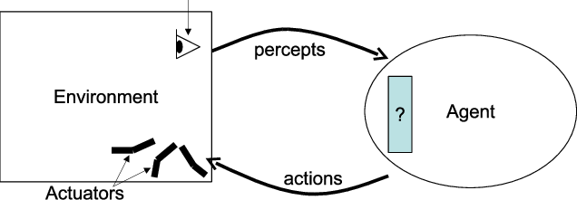
</center>

- Usaremos «agente» y «robot software» de forma indistinta
- Cuando el agente incorpora técnicas de inteligencia artificial, hablamos de **agente inteligente**

> Fuente imagen: https://www.researchgate.net/publication/201018712_Towards_a_Unified_View_of_the_Environments_within_Multi-Agent_Systems
---

# El ciclo agente-entorno

$$f: \mathcal{P}^* \rightarrow \mathcal{A}$$
- El agente recibe **percepciones** $\mathcal{P}^*$ del entorno a través de sus sensores
- Internamente, procesa esas percepciones según su **programa de agente** $\rightarrow$
- El programa decide qué **acción** $\mathcal{A}$ ejecutar a través de los actuadores
- Esa acción modifica el entorno, generando nuevas percepciones y el ciclo se repite

---

# El ciclo agente-entorno

Este ciclo percepción → decisión → acción es el esqueleto común a **todas** las arquitecturas que veremos hoy. Lo que cambia entre una arquitectura y otra es **cómo se implementa la caja de decisión**.

<center>

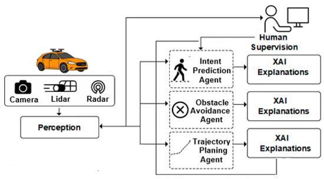
</center>

> Fuente: https://www.mdpi.com/2624-8921/8/1/8
---

# Agente racional

Un agente es **racional** cuando, para cada secuencia de percepciones posible, selecciona la acción que se espera maximice su **medida de rendimiento**, dado:

- La evidencia aportada por la secuencia de percepciones hasta el momento
- El conocimiento del entorno que el agente posee de antemano

Importante: racionalidad **no es lo mismo que omnisciencia**

- Un agente racional puede fallar si el entorno le oculta información
- Lo que se le exige es tomar la mejor decisión posible **con lo que sabe**, no adivinar el futuro

> Es decir, si no somos capaces de saber cómo de bien lo estamos haciendo, no se pueden tomar decisiones **coherentes**
---

# Medida de rendimiento

La **medida de rendimiento** es el criterio externo y objetivo que usamos para evaluar el éxito del comportamiento de un agente.

- Debe definirse en términos de lo que se quiere lograr **en el entorno**, no de cómo creemos que el agente debería comportarse
-  :warning: **Ejemplo**: para una aspiradora robótica, "**cantidad de suciedad recogida**" es peor medida que "**limpieza del suelo mantenida en el tiempo con bajo consumo eléctrico y sin daños**" — la primera puede incentivar comportamientos perversos (ensuciar y limpiar en bucle)

---

# El marco PEAS

Para especificar el entorno de trabajo de un agente de forma sistemática se usa el marco **PEAS**:

| Elemento | Pregunta que responde |
|---|---|
| **P**erformance (Rendimiento) | ¿Cómo mido el éxito? |
| **E**nvironment (Entorno) | ¿Dónde opera el agente? |
| **A**ctuators (Actuadores) | ¿Cómo actúa? |
| **S**ensors (Sensores) | ¿Cómo percibe? |

---

# El marco PEAS: Ejemplo

<center>

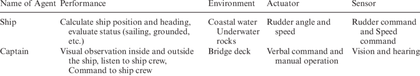
</center>

> Fuente: https://www.researchgate.net/publication/282201644_Accident_analysis_by_logic_programming_technique

<center>

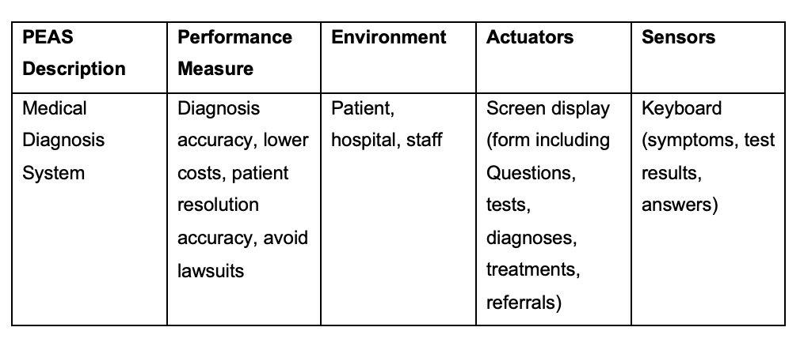
</center>

> Fuente: https://www.chegg.com/homework-help/questions-and-answers/discuss-critically-examine-complications-may-arise-evaluating-behavior-intelligent-agents--q93838570

---

# Por qué importa la arquitectura interna

Dos agentes pueden tener exactamente el mismo comportamiento observable y, sin embargo, estar construidos de maneras radicalmente distintas por dentro.

La **arquitectura** es precisamente esa organización interna: qué módulos existen, cómo se comunican, y qué mecanismo decide la acción a partir de las percepciones.

La arquitectura elegida determina, entre otras cosas:

- La **velocidad de reacción** del agente
- Su capacidad de **planificar a largo plazo**
- Su **robustez** ante entornos cambiantes o imprevistos
- Su **explicabilidad**: si el agente puede justificar por qué hizo algo
- El **coste computacional** de tomar cada decisión

---

# Por qué importa la arquitectura interna

<div align="center">
  <a>
     
  </a>
  <a>
    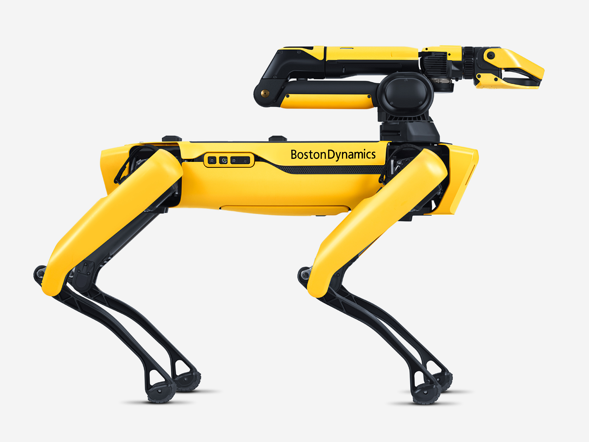
  </a>
</div>

> Fuentes: https://comerciallolo.com/p/perro-pipi-max-8421134093935
>
> https://arstechnica.com/gadgets/2021/02/boston-dynamics-robot-dog-gets-an-arm-attachment-self-charging-capabilities/

---


<!-- _class: section -->

# Bloque 2
## Sistemas intencionales

---

# La postura intencional de Dennett

Un **sistema intencional** es aquel cuyo comportamiento podemos describir y predecir de forma útil atribuyéndole creencias, deseos y racionalidad, aunque no sepamos —o no importe— cómo funciona realmente por dentro (Dennett, 1987)$^1$.

```
«Bea lleva una cámara porque cree que verá algo interesante»
```

- No estamos afirmando que _Bea_ tenga literalmente un módulo de "creencia" en el cerebro
- Estamos usando ese vocabulario porque **nos permite predecir su comportamiento** de forma más económica que describiendo cada neurona

La **postura intencional** (intentional stance) es una de las 3 estrategias que propone Dennett para predecir el comportamiento de un sistema, junto a la postura física y la postura de diseño.

> $^1$: Yo tampoco me esperaba una cita de un libro de filosofía en la asignatura de robótica
---

# De la filosofía a la ingeniería

¿Por qué le importa esto a alguien que construye robots software?

- Porque un agente puede **definirse y especificarse correctamente** mediante posturas intencionales:
```
"este agente cree que la batería está baja"
"este agente desea completar la tarea"
"este agente tiene la intención de recargar antes de continuar"
```
- Este vocabulario no es solo una metáfora cómoda: **da lugar directamente a una familia de arquitecturas** que representan explícitamente creencias, deseos e intenciones como estructuras de datos manipulables por el propio agente

Todo esto es el equivalente a observar a nuestros agentes como cajas negras donde es **más relevante** entender lo que hacen que el por qué.

---

<!-- _class: section -->

## Arquitecturas reactivas

---

# Arquitecturas reactivas: principio de diseño

Las arquitecturas **reactivas** responden a los cambios del entorno de forma rápida, **sin** mantener un modelo simbólico interno del mundo ni realizar planificación detallada.

- Se basan en un conjunto de **reglas condición-acción**: "si percibo X, ejecuto Y"
- Interactúan directamente con el entorno, decidiendo en base a la información sensorial **actual** (sin memoria de largo plazo)
- Se adaptan bien a entornos **dinámicos e impredecibles**
- Son especialmente útiles cuando se requieren respuestas en **tiempo real**

| Robot | Condición | Acción |
|---|---|---|
| Coche autónomo | Viene una curva | Disminuir velocidad |
| Industria metalúrgica | Sobrecalentamiento | Encender ventiladores |
| Yo en la cama | Suena la alarma | Pulso "Añadir 1 min" |

---

# La arquitectura de subsunción (Brooks, 1986)

Propuesta por Rodney Brooks como alternativa radical a la robótica simbólica dominante en los años 80, bajo el lema **"inteligencia sin representación"** (Brooks, 1991).

**Idea central**: en lugar de un único módulo central "inteligente", el comportamiento se organiza en **capas independientes de comportamiento**, cada una encargada de una competencia concreta (evitar obstáculos, deambular, explorar...).

- Cada capa conecta sensores con actuadores de forma directa
- Las capas se ejecutan en paralelo
- Las capas superiores pueden **subsumir** (inhibir o sustituir) el comportamiento de las inferiores cuando es necesario

---

# La arquitectura de subsunción (Brooks, 1986)

<center>

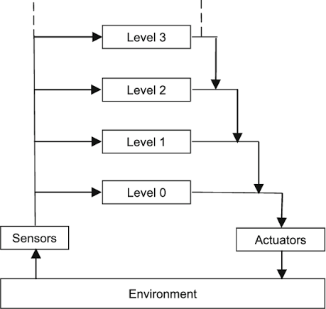
</center>

> Fuente: https://www.researchgate.net/publication/225257926_Integrated_cognitive_architectures_A_survey

---

# Arbitraje entre capas

El mecanismo que decide qué capa _gana_ en cada instante es crítico en esta arquitectura:

- **Inhibición**: una capa superior puede bloquear la entrada de una capa inferior
- **Supresión**: una capa superior puede sustituir la salida de una capa inferior por la suya propia

Este arbitraje es lo que permite que comportamientos simples y locales (cada capa) den lugar a un comportamiento global coherente **sin que ninguna capa "entienda" el objetivo completo**.

---

# Arbitraje entre capas: Ejemplo 1

<center>

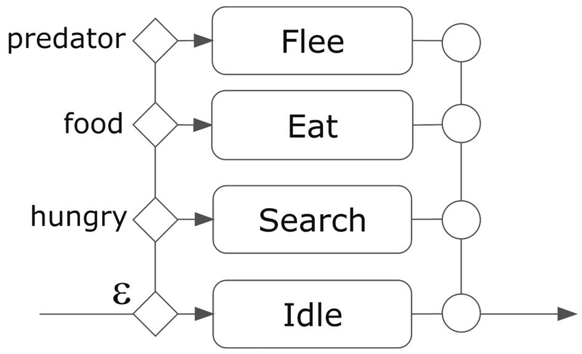
</center>

> Fuente: https://www.researchgate.net/publication/220978571_Multi-Agent_Coordination_Using_Dynamic_Behavior-Based_Subsumption

---

# Arbitraje entre capas: Ejemplo 2

<center>

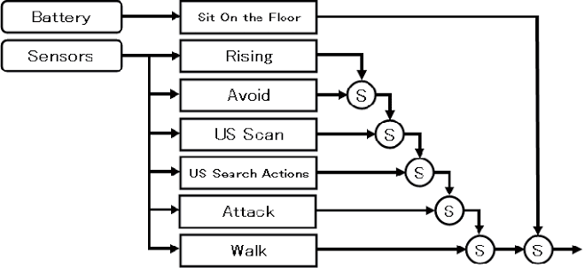
</center>

> Fuente: https://www.researchgate.net/publication/290772545_Practical_Education_Curriculum_for_Autonomous_Mobile_Robot_Project_Learning_Program_for_School_Based_on_Subsumption_Architecture

---

# Comportamiento emergente y ejemplos

Cuando varias capas reactivas simples interactúan, puede surgir un comportamiento global que **parece** complejo o incluso deliberado, sin que exista ningún plan explícito. A esto se le llama **comportamiento emergente**.

- Robots aspiradores domésticos (p. ej. Roomba)
- Robots insectoides de investigación (inspirados en insectos sociales)
- Enjambres de robots simples que cooperan sin coordinación central

<center>

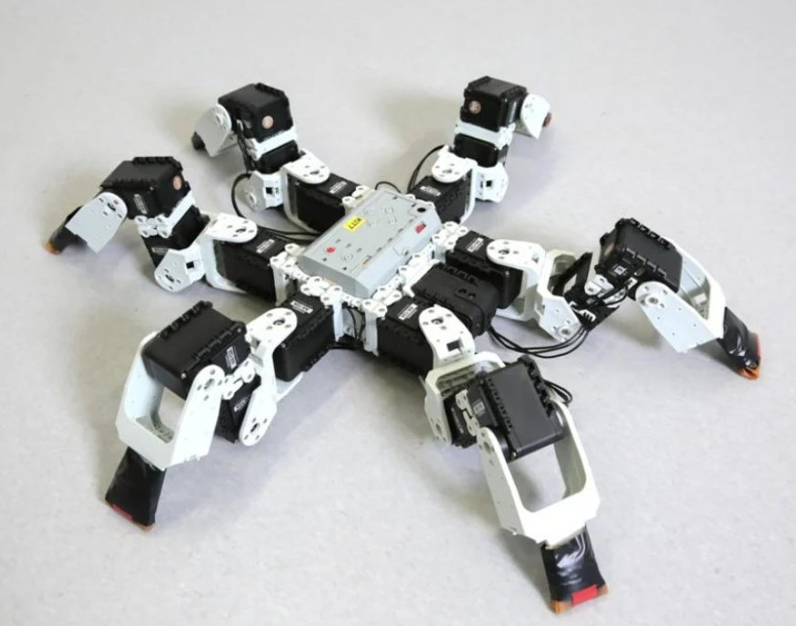
</center>

> Fuente: https://interestingengineering.com/innovation/insect-inspired-robot-has-people-bugging

---

# Ventajas y limitaciones de las arquitecturas reactivas

| Ventajas | Limitaciones |
|---|---|
| Respuesta muy rápida | Sin memoria de largo plazo |
| Robustas ante entornos dinámicos | Difícil perseguir objetivos complejos o a largo plazo |
| Simples de implementar y depurar por capa | El comportamiento global es difícil de predecir de antemano |
| Buena tolerancia a fallos parciales | No pueden "explicar" por qué hicieron algo |

**¿Cuándo elegir una arquitectura reactiva?** 

```
Cuando el entorno es muy dinámico, impredecible,y la velocidadde respuesta 
importa más que la sofisticación del razonamiento.
```

---

<!-- _class: section -->

## Arquitecturas deliberativas

---

# El ciclo sense-plan-act

Siguen el enfoque clásico y simbólico de la IA agéntica: **sentir → planificar → actuar**.

- El agente construye y mantiene un **modelo simbólico interno** del mundo
- Antes de actuar, **razona** sobre ese modelo: analiza opciones, genera y compara planes
- Solo al final del ciclo se ejecuta una acción

Este enfoque contrasta frontalmente con el de las arquitecturas reactivas, donde no existe esta fase **explícita** de planificación.

<center>


</center>

> Fuente: https://www.teachkidsrobotics.com/what-is-a-robot/

---

# Representación simbólica y planificación

- El conocimiento se representa mediante **símbolos** manipulables (estados, predicados, reglas lógicas), no directamente como señales sensoriales crudas
- Se emplean **mecanismos de planificación** que permiten al agente diseñar una secuencia de acciones para alcanzar sus objetivos antes de ejecutarlas

Un referente histórico de planificador simbólico es **STRIPS** (Fikes & Nilsson, 1971), que formalizó estados, acciones, precondiciones y efectos

---

# Arquitecturas de pizarra (blackboard)

Un patrón deliberativo clásico es la **arquitectura de pizarra** (Hayes-Roth, 1985):

- Existe una **estructura de datos** compartida (la "pizarra") visible para todos los módulos
- Distintos módulos especializados ("fuentes de conocimiento") leen y escriben en la pizarra de forma oportunista
- Un módulo de control decide **qué** fuente de conocimiento actúa en cada momento

Es útil cuando un problema requiere combinar conocimiento de naturalezas muy distintas (por ejemplo, visión + lenguaje + planificación) sin forzar un flujo rígido entre ellos.

---

# Arquitecturas de pizarra (blackboard)

<center>

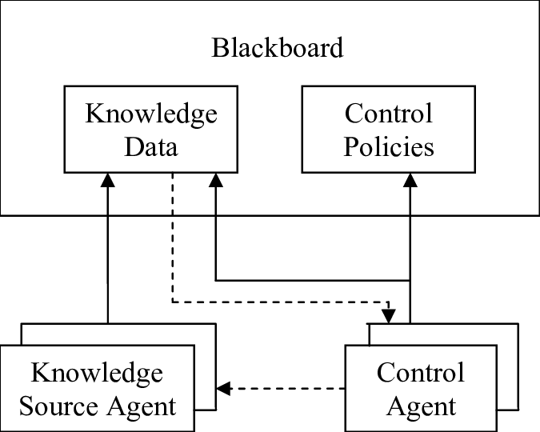
</center>

> Fuente: https://www.researchgate.net/publication/4141312_Event-based_blackboard_architecture_for_multi-agent_systems

---

# Meta-razonamiento

Las arquitecturas deliberativas más avanzadas pueden realizar **meta-razonamiento**: razonar sobre su propio proceso de razonamiento.

- :warning: **Ejemplo**: decidir **cuánto tiempo** dedicar a planificar antes de que la ventana de oportunidad para actuar se cierre
- Permite mayor **flexibilidad y adaptabilidad**: el agente no solo resuelve el problema, sino que gestiona sus propios recursos de razonamiento

Es muy común hoy en día, desde que existe la IA con razonamiento y las técnicas chain-of-thought

---

# Ventajas y limitaciones de las arquitecturas deliberativas

| Ventajas | Limitaciones |
|---|---|
| Comportamiento complejo | Lentas: planificar cuesta tiempo de cómputo |
| Explican y justifican decisiones | Frágiles ante entornos muy dinámicos|
| Razonan antes de actuar | Requieren un modelo correcto y actualizado |
| Reutilizan conocimiento | Mayor coste de implementación y mantenimiento |

**¿Cuándo elegir una arquitectura deliberativa?**

```
Cuando el entorno es relativamente predecible, hay tiempo para planificar,
y el objetivo requiere razonamiento a medio o largo plazo (logística,
planificación de rutas complejas, negociación).
```

---

<!-- _class: section -->

## Arquitecturas híbridas

---

# Motivación: lo mejor de ambos mundos

Ni lo puramente reactivo ni lo puramente deliberativo basta en la mayoría de robots reales:

- Un robot **solo reactivo** no puede perseguir objetivos complejos a largo plazo
- Un robot **solo deliberativo** puede ser demasiado lento para reaccionar ante un obstáculo repentino

Las **arquitecturas híbridas** combinan ambos enfoques organizándolos en **capas** que operan a distinta velocidad y con distinto nivel de abstracción.

---

# Arquitecturas híbrida

<center>


</center>

> Fuente: https://www.researchgate.net/publication/351819214_Towards_a_Unified_Representation_for_Human-Robot_Control_Architectures

---

# Arquitecturas en tres capas

Un patrón híbrido muy extendido organiza el sistema en tres niveles (Gat, 1998):

1. **Capa reactiva (control)**: bucles de control rápidos, de bajo nivel, tipo reflejo (evitar colisión inminente)
2. **Capa de secuenciación / ejecución**: traduce planes de alto nivel en secuencias de comportamientos reactivos, gestiona el orden y las excepciones
3. **Capa deliberativa (planificación)**: opera a más largo plazo, con modelos simbólicos y planificación, y sin restricción estricta de tiempo real

---

# Ejemplos de arquitecturas híbridas de referencia

- **AuRA** (Autonomous Robot Architecture, Arkin, 1989): combina esquemas motores reactivos con planificación jerárquica de alto nivel
- **InteRRaP** (Müller & Pischel, 1994): organiza el agente en capas de comportamiento, planificación local y planificación cooperativa/social

**Por qué importan hoy**: la inmensa mayoría de robots físicos autónomos en producción (coches autónomos, robots de almacén, drones) usan arquitecturas híbridas, no arquitecturas puras. Son el punto de equilibrio práctico entre velocidad de reacción y capacidad de razonamiento.

---

<!-- _class: section -->


## Arquitecturas BDI (Belief-Desire-Intention)

---

# Fundamento formal de BDI

Las arquitecturas **BDI** (Rao & Georgeff, 1995) son la traducción directa de la postura intencional a una arquitectura implementable, mediante tres **estructuras de datos** explícitas:

- **Beliefs (creencias)**: lo que el agente cree que es cierto sobre el mundo (puede ser incorrecto o estar desactualizado)
- **Desires (deseos)**: los objetivos que el agente querría alcanzar, no necesariamente todos compatibles entre sí
- **Intentions (intenciones)**: el subconjunto de deseos que el agente **se ha comprometido** activamente a perseguir en **este momento**

La diferencia entre deseo e intención es clave: un agente puede desear muchas cosas a la vez, pero solo puede comprometerse a perseguir un subconjunto consistente de ellas.

---

# Fundamento formal de BDI

<center>

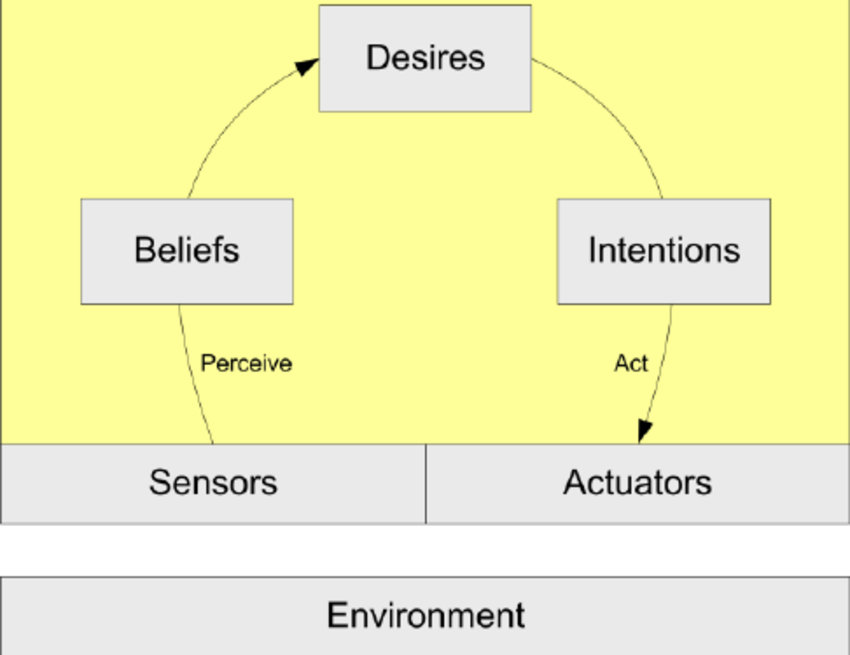
</center>

> Fuente: https://www.researchgate.net/publication/292140170_A_model_for_an_Information_security_management_system_ISMS_Tool_based_multi_agent_system

---

# El ciclo de deliberación BDI

En cada ciclo, un agente BDI típicamente:

1. Actualiza sus **creencias** a partir de nuevas percepciones
2. Genera **opciones** de deseos posibles a partir de las creencias actuales
3. **Delibera**: filtra esas opciones y decide qué subconjunto se convierte en **intenciones**
4. Ejecuta un **plan** asociado a cada intención activa, revisándolo si las creencias cambian sustancialmente
---

# Sistemas BDI de referencia

- **PRS** (Procedural Reasoning System, Georgeff & Lansky, 1987): uno de los primeros sistemas en implementar el modelo BDI de forma práctica
- **dMARS**: evolución de PRS orientada a sistemas multiagente distribuidos
- **Jason**: intérprete moderno y de código abierto del lenguaje AgentSpeak, ampliamente usado hoy en investigación y docencia (Bordini, Hübner & Wooldridge, 2007)

**Aplicaciones típicas**: agentes software autónomos de larga duración, sistemas de gestión de crisis, y —lo que nos interesa especialmente— **softbots**, que veremos en detalle más adelante.

---

<!-- _class: section -->

## Arquitecturas cognitivas

---

# Arquitecturas cognitivas

Un tipo particular de arquitectura deliberativa busca no solo que el agente se comporte de forma racional, sino **modelar cómo razona la mente humana**. Se las conoce como **arquitecturas cognitivas**.

Se mencionan aquí como mapa de referencia: su uso principal está más en la **investigación en ciencia cognitiva** que en robots de producción, pero conviene conocer que existen si en el futuro profundizas en agentes inteligentes.

---

# SOAR (Laird, Newell & Rosenbloom, 1987)

Orientada a la resolución de problemas mediante búsqueda en espacios de estados y aprendizaje por fragmentación

<center>

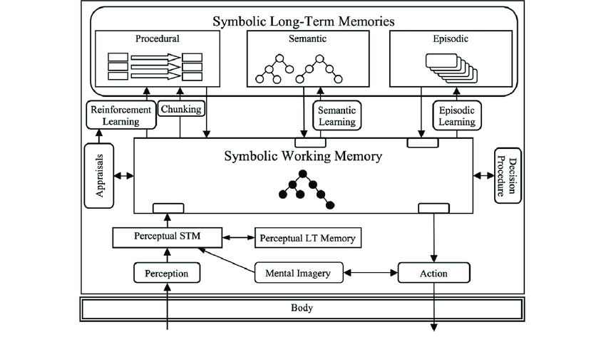
</center>

> Fuente: https://www.researchgate.net/publication/257581140_Effective_and_efficient_forgetting_of_learned_knowledge_in_Soar's_working_and_procedural_memories

---

# ACT-R 
Modelo de cognición humana que distingue memoria declarativa y memoria procedimental, muy usado en psicología cognitiva computacional

<center>

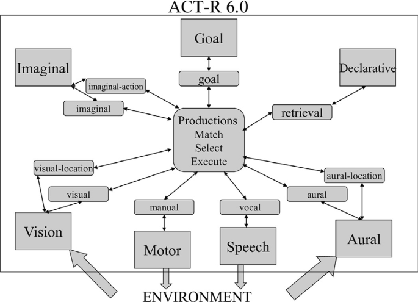
</center>

> Fuente: https://link.springer.com/article/10.1007/s11257-019-09239-2

---

<!-- _class: section -->

## Arquitecturas multiagente

---

# De un agente a varios

Hasta ahora hemos hablado de la arquitectura de **un** agente. Pero en la práctica, y especialmente en softbots y RPA, es habitual que **varios agentes coexistan y cooperen**.

- Un **sistema multiagente (SMA)** es un conjunto de agentes que interactúan entre sí, cada uno con su propia arquitectura interna
- Pueden cooperar hacia un objetivo común, competir por recursos, o simplemente coexistir en el mismo entorno

Esto añade una capa de complejidad nueva: ya no basta con decidir bien de forma individual, hay que **coordinarse**.

---

# Comunicación entre agentes

Para que los agentes cooperen necesitan un lenguaje común. Un estándar histórico de referencia es **FIPA-ACL** (Agent Communication Language), que define actos comunicativos como "informar", "solicitar" o "proponer" entre agentes (FIPA, 2002).

- Permite que agentes construidos por distintos desarrolladores, con arquitecturas internas distintas, se entiendan
- Es la base conceptual de mucha coordinación multiagente posterior, incluida buena parte de la orquestación de agentes moderna que veremos en el Bloque 10

---

# Ejemplo mensaje FIPA-ACL
<center>

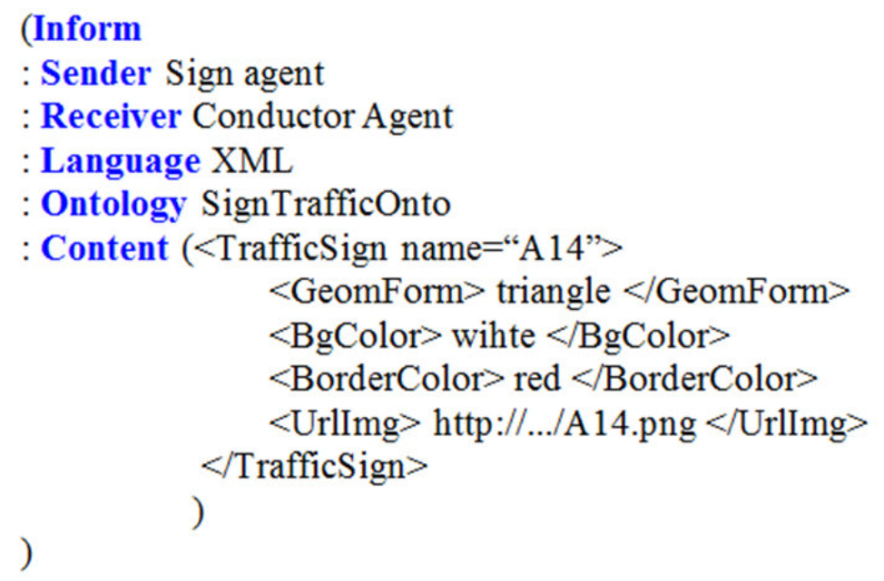
</center>

> Fuente: https://www.researchgate.net/publication/339954113_A_Novel_Deep_Learning_Approach_for_Semantic_Interoperability_Between_Heteregeneous_Multi-Agent_Systems
---

# Coordinación y organización

Algunas estrategias comunes para organizar sistemas multiagente:

- **Jerárquica**: un agente coordinador asigna tareas a agentes subordinados
- **Por mercado**: los agentes "pujan" por tareas o recursos
- **Por consenso**: los agentes negocian hasta llegar a un acuerdo compartido

---

<!-- _class: section -->

## Comparativa de arquitecturas

---

# Tabla comparativa

| Arquitectura | Velocidad | Planificación | Adaptabilidad | Explicabilidad | Complejidad |
|---|---|---|---|---|---|
| Reactiva | Muy alta | Nula | Alta | Baja | Baja |
| Deliberativa | Baja | Alta | Baja | Alta | Alta |
| Híbrida | Media-alta | Media-alta | Alta | Media | Alta |
| BDI | Media | Alta (orientada a objetivos) | Media | Alta | Media-alta |
| Cognitiva | Baja-media | Alta | Media | Alta | Alta |

---

# ¿Qué arquitectura necesito?

> [ESPACIO PARA IMAGEN: árbol de decisión con preguntas tipo "¿Necesitas tiempo real estricto?" → sí → "¿El entorno es muy dinámico?" → sí → Reactiva; no → Híbrida; y así sucesivamente hasta cubrir las cinco familias vistas]

La pregunta clave para elegir arquitectura no es "¿cuál es mejor?" sino **"¿qué compromisos puedo permitirme para este problema concreto?"**: velocidad frente a razonamiento, simplicidad frente a capacidad de explicación, coste de desarrollo frente a flexibilidad.

---

<!-- _class: section -->

## Arquitecturas modernas: agentes basados en LLM

---

# Por qué este bloque

En los últimos años una nueva generación de agentes usa un **modelo de lenguaje$^2$ (LLM)** como "cerebro" central de decisión, en lugar de reglas simbólicas escritas a mano o planificadores clásicos.

Lo importante: **el ciclo percepción-decisión-acción del Bloque 1 no ha cambiado**$^3$. Lo que cambia es cómo se implementa la caja de decisión, y con qué velocidad ha evolucionado el campo en los últimos años.

> $^2$: Están por todas partes
> $^3$: Es lo bueno de la filosofía, que no está atada a los avances tecnológicos
---

# El bucle ReAct

**ReAct** (Yao et al., 2023) propone intercalar explícitamente **razonamiento** (pensar en texto qué hacer) y **acción** (ejecutar una herramienta) dentro del mismo bucle:

1. El modelo genera un **pensamiento** ("necesito buscar el precio actual")
2. El modelo genera una **acción** (llamar a una herramienta de búsqueda)
3. El entorno devuelve una **observación** (el resultado de la búsqueda)
4. El modelo genera el siguiente **pensamiento** a partir de esa observación

Es, en esencia, un ciclo **sense-plan-act**$^4$: donde el "planificador" es un LLM que razona en lenguaje natural en lugar de símbolos lógicos formales.

> $^4$: Como siempre, pensamos que re-inventamos la rueda, pero no todo es tan novedoso como lo venden

---

# El bucle ReAct

<center>

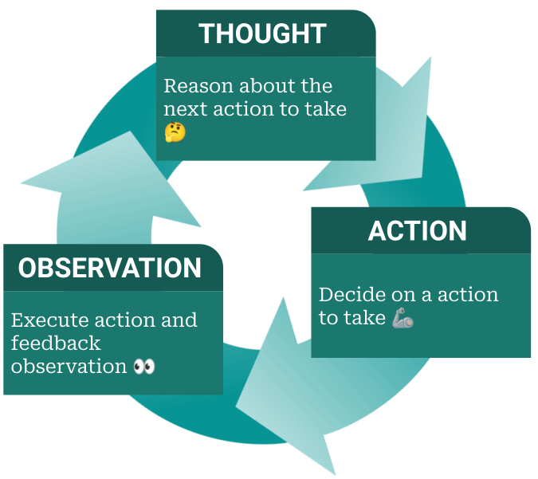
</center>

> Fuente: https://peterroelants.github.io/posts/react-repl-agent/
---

# Planificación: Plan-and-Execute frente a ReAct

- **ReAct**: decide un paso, lo ejecuta, observa, decide el siguiente — bueno para tareas cortas y muy dependientes del contexto
- **Plan-and-Execute**: primero genera una lista completa de pasos, y después los ejecuta uno a uno, revisando el plan si algo falla — mejor para tareas largas y complejas

Esta distinción es literalmente el mismo debate reactivo-vs-deliberativo anterior.


<center>

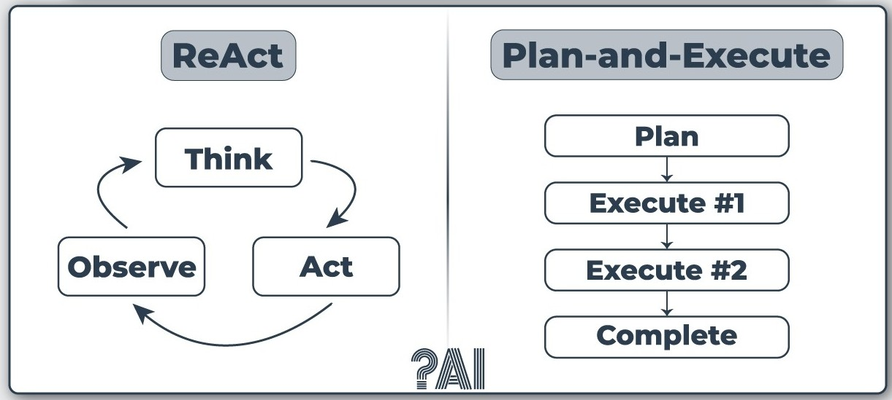
</center>

> Fuente: https://peterroelants.github.io/posts/react-repl-agent/

---

# Memoria en agentes modernos

- **Memoria de corto plazo**: la propia ventana de contexto del modelo
- **Memoria de largo plazo**: una base de datos que almacena información pasada
- **RAG** (Retrieval-Augmented Generation, Lewis et al., 2020): técnica que combina recuperación de información externa con generación de texto

<center>

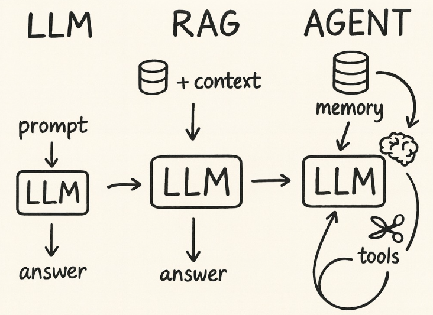
</center>

> Fuente: https://www.instagram.com/p/DRg9y14iR1m/

---

# Uso de herramientas (tool use)

La capacidad de un agente LLM de invocar herramientas externas, una API, una búsqueda web, una calculadora, un intérprete de código, es la evolución directa del concepto clásico de **actuador**, adaptado a un entorno digital.

- El modelo decide **qué herramienta** usar y **con qué parámetros**, a partir de una descripción de la herramienta disponible
- Este patrón se popularizó con trabajos como Toolformer (Schick et al., 2023) y es hoy un estándar en prácticamente todos los frameworks de agentes

---

# Frameworks y orquestación actuales

El ecosistema de herramientas para construir agentes LLM ha madurado rápidamente:

- **LangChain / LangGraph**: construcción de flujos de agentes y grafos de ejecución
- **AutoGen / Microsoft Agent Framework**: orquestación de agentes, con el segundo consolidándose durante 2025-2026 como runtime unificado sobre conceptos ya presentes en Semantic Kernel y AutoGen (Future AGI, 2026)
- **CrewAI**: orquestación de equipos de agentes con roles definidos

Este panorama cambia con rapidez: lo importante no son los nombres concretos de las herramientas, sino los **patrones de diseño subyacentes**, que sí son estables.

---

# Orquestación multiagente moderna

La tendencia dominante en 2026 ya no es un único agente LLM resolviendo todo, sino **varios agentes especializados colaborando bajo una capa de orquestación**.

La coordinación combina agentes de IA, bots deterministas tipo RPA, APIs y personas, todo dentro del mismo flujo (SS&C Blue Prism, 2026).

Esto no es casual: es la misma idea de **arquitectura híbrida**, combinar lo reactivo/determinista con lo deliberativo/flexible, aplicada ahora a gran escala en sistemas de automatización empresarial

---

# BDI clásico frente a agente LLM moderno

| Concepto BDI (1995) | Equivalente en agente LLM (2026) |
|---|---|
| Creencias | Contexto + memoria recuperada (RAG) |
| Deseos | Objetivo/tarea indicada en el prompt |
| Intenciones | Plan activo en curso de ejecución |
| Ciclo de deliberación | Bucle ReAct / Plan-and-Execute |
| Comunicación entre agentes (FIPA-ACL) | Protocolos de orquestación multiagente |

La conclusión no es que "todo sea nuevo", sino que **los mismos problemas de diseño de siempre siguen ahí**, lo que ha cambiado es la tecnología que implementa cada pieza.

---

<!-- _class: section -->

# Bloque 3
## Por qué todo esto importa

---

# Síntesis

Todas las arquitecturas vistas hoy resuelven **el mismo problema**: percibir, decidir y actuar. Lo que las diferencia son los **compromisos** que asumen:

- Velocidad **vs.** capacidad de razonamiento
- Simplicidad **vs.** explicabilidad
- Autonomía individual **vs.** coordinación multiagente

No existe "la mejor arquitectura" en abstracto: existe la arquitectura adecuada **para un problema concreto**, con sus restricciones de tiempo, entorno y objetivos.

---

# ¡GRACIAS!<!--_class: endpage-->

---

<!-- _class: section -->

# Referencias

---

# Referencias (I)

Anderson, J. R. (1996). ACT: A simple theory of complex cognition. *American Psychologist*, *51*(4), 355–365.

Arkin, R. C. (1989). Motor schema-based mobile robot navigation. *The International Journal of Robotics Research*, *8*(4), 92–112.

Bordini, R. H., Hübner, J. F., & Wooldridge, M. (2007). *Programming multi-agent systems in AgentSpeak using Jason*. Wiley.

Brooks, R. A. (1986). A robust layered control system for a mobile robot. *IEEE Journal of Robotics and Automation*, *2*(1), 14–23.

Brooks, R. A. (1991). Intelligence without representation. *Artificial Intelligence*, *47*(1–3), 139–159.

Dennett, D. C. (1987). *The intentional stance*. MIT Press.

FIPA. (2002). *FIPA ACL message structure specification*. Foundation for Intelligent Physical Agents.

---

# Referencias (II)

Fikes, R. E., & Nilsson, N. J. (1971). STRIPS: A new approach to the application of theorem proving to problem solving. *Artificial Intelligence*, *2*(3–4), 189–208.

Future AGI. (2026). *LLM agent architectures in 2026: Core components and patterns*. https://futureagi.com/blog/llm-agent-architectures-core-components/

Gat, E. (1998). On three-layer architectures. In D. Kortenkamp, R. P. Bonasso, & R. Murphy (Eds.), *Artificial intelligence and mobile robots* (pp. 195–210). AAAI Press.

Georgeff, M. P., & Lansky, A. L. (1987). Reactive reasoning and planning. In *Proceedings of the Sixth National Conference on Artificial Intelligence (AAAI-87)* (pp. 677–682).

Hayes-Roth, B. (1985). A blackboard architecture for control. *Artificial Intelligence*, *26*(3), 251–321.

Laird, J. E., Newell, A., & Rosenbloom, P. S. (1987). SOAR: An architecture for general intelligence. *Artificial Intelligence*, *33*(1), 1–64.

---

# Referencias (III)

Lewis, P., Perez, E., Piktus, A., Petroni, F., Karpukhin, V., Goyal, N., Küttler, H., Lewis, M., Yih, W., Rocktäschel, T., Riedel, S., & Kiela, D. (2020). Retrieval-augmented generation for knowledge-intensive NLP tasks. In *Advances in Neural Information Processing Systems 33 (NeurIPS 2020)*.

Müller, J. P., & Pischel, M. (1994). InteRRaP: An integrated architecture for situated agents. In *Proceedings of the German Workshop on Distributed Artificial Intelligence*.

Rao, A. S., & Georgeff, M. P. (1995). BDI agents: From theory to practice. In *Proceedings of the First International Conference on Multiagent Systems (ICMAS-95)* (pp. 312–319).

Russell, S., & Norvig, P. (2020). *Artificial intelligence: A modern approach* (4.ª ed.). Pearson.

---

# Referencias (IV)

Schick, T., Dwivedi-Yu, J., Dessì, R., Raileanu, R., Lomeli, M., Zettlemoyer, L., Cancedda, N., & Scialom, T. (2023). Toolformer: Language models can teach themselves to use tools. In *Advances in Neural Information Processing Systems 36 (NeurIPS 2023)*.

Shinn, N., Cassano, F., Berman, E., Gopinath, A., Narasimhan, K., & Yao, S. (2023). Reflexion: Language agents with verbal reinforcement learning. In *Advances in Neural Information Processing Systems 36 (NeurIPS 2023)*.

SS&C Blue Prism. (2026, enero). *AI agent trends in 2026*. https://www.blueprism.com/resources/blog/future-ai-agents-trends/

Wooldridge, M. (2009). *An introduction to multiagent systems* (2.ª ed.). Wiley.

Yao, S., Zhao, J., Yu, D., Du, N., Shafran, I., Narasimhan, K., & Cao, Y. (2023). ReAct: Synergizing reasoning and acting in language models. In *Proceedings of the Eleventh International Conference on Learning Representations (ICLR 2023)*.
