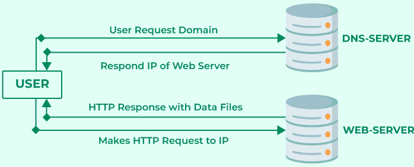
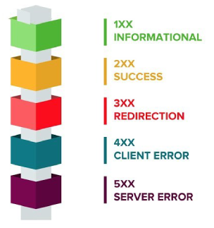
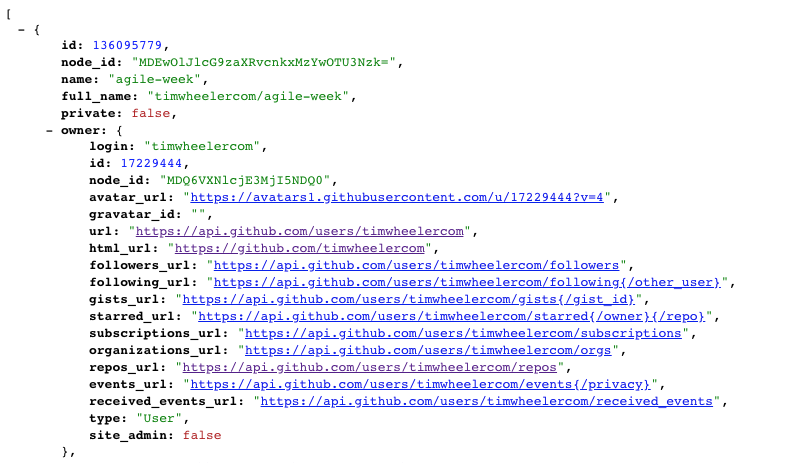
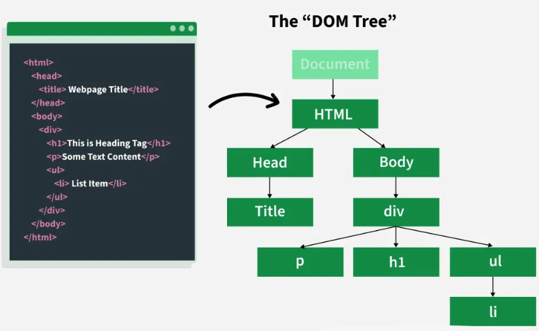
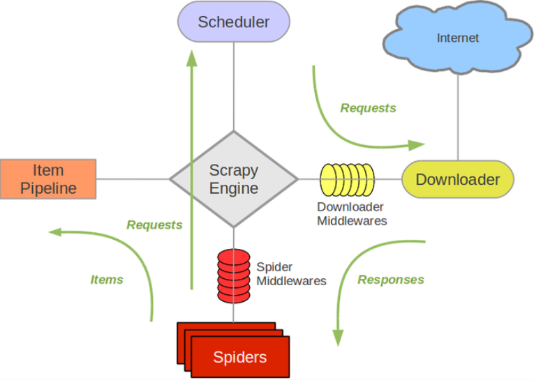
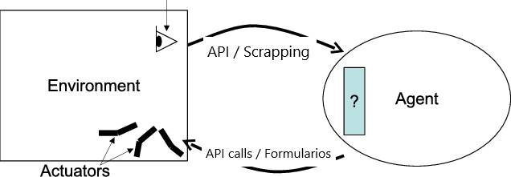

<!-- _class: titlepage -->

# Programación de softbots

## Robótica - Grado en Ingeniería de Computadores

### Departamento de Sistemas Informáticos

#### E.T.S.I. de Sistemas Informáticos - Universidad Politécnica de Madrid

##### Curso 2025-2026

[](https://creativecommons.org/licenses/by-nc-sa/4.0/)

---

# Objetivos de aprendizaje de hoy

- Entender cómo se comunican dos **aplicaciones** a través de **Internet** (HTTP, APIs, REST)
- Dominar el **web scraping** en profundidad: cuándo usarlo, cómo hacerlo bien y sus límites legales y éticos
- Comprender formalmente qué es un **softbot**
- Conocer los **patrones de programación** necesarios para que un softbot funcione de forma robusta y sostenida en el tiempo
- Situar todo esto en el **panorama actual**: extracción asistida por IA y agentes que operan un navegador

---

<!-- _class: section -->

# Bloque 1
## Servicios accesibles a través de Internet

---

# El modelo cliente-servidor

Es el modelo de comunicación sobre el que se construye toda la Web:

- **Cliente**: solicita recursos (por ejemplo, nuestro softbot)
- **Servidor**: proporciona los recursos solicitados

Una sesión se inicia cuando el cliente envía una petición al servidor:

1. El cliente establece una conexión (típicamente TCP) con el servidor
2. El cliente envía una **petición** (_request_) y espera respuesta
3. El servidor procesa la petición y envía una **respuesta** (_response_), incluyendo un **código de estado**

---

# El modelo cliente-servidor

<center>


</center>

> Fuente: https://www.geeksforgeeks.org/system-design/client-server-model/

---

# El protocolo HTTP

_Hypertext Transfer Protocol_ (HTTP), diseñado en 1990, es la base de la comunicación de datos en la Web.

- Protocolo a nivel de aplicación, construido sobre TCP/IP
- Puerto estándar 80 (HTTP) y 443 (HTTPS, la versión cifrada)
- Hoy en día se usa mayoritariamente HTTP/2 (RFC 7540) y, cada vez más, HTTP/3
- Es lo bastante abierto como para no impedir el desarrollo de aplicaciones de terceros, como nuestros softbots

HTTP se usa principalmente para transmitir **recursos**:

- Un recurso es un fragmento de información identificable mediante una URL
- Puede ser un archivo estático o una salida generada dinámicamente

---

# URL: identificando recursos en la Web

Una _Uniform Resource Locator_ (URL) tiene la siguiente estructura:

```
protocolo://servidor:puerto/path/hasta/el/recurso?query=con&algun=parametro
```

Por ejemplo:

```
https://www.google.com/search?q=boniato+al+horno&sclient=gws-wiz-serp
```

- Si no se especifica el puerto, se usa el puerto por defecto del protocolo (HTTP: 80, HTTPS: 443)
- La parte `?query=con&algun=parametro` se conoce como _query string_

---

# Mensajes en HTTP: request y response

Toda comunicación HTTP se basa en dos tipos de mensaje:

- **Request**: mensaje enviado por el cliente al servidor
- **Response**: mensaje enviado por el servidor al cliente

Ambos comparten estructura, con diferencias:

- Ambos poseen cabeceras con metainformación (_headers_)
- Ambos pueden incluir un cuerpo adicional con datos
- La request indica el **método** y el **recurso** al que se quiere acceder
- La response indica el **código de estado** de la respuesta

La estructura exacta de los mensajes difiere entre HTTP/1.1 y HTTP/2, pero las bibliotecas de Python nos abstraen de ese detalle.

---

# Métodos HTTP

| Método | Propósito |
|---|---|
| `GET` | Solicita un recurso |
| `HEAD` | Solicita solo los metadatos de un recurso |
| `POST` | Envía datos al servidor (p. ej. crear un recurso) |
| `PUT` | Envía un recurso completo para reemplazar uno existente |
| `PATCH` | Envía una actualización parcial de un recurso |
| `DELETE` | Elimina un recurso |
| `OPTIONS` | Solicita qué métodos soporta el servidor para un recurso |
| `CONNECT` / `TRACE` | Uso avanzado: túneles y diagnóstico |

> Esto es la teoría, porque en la práctica cada servidor implementa lo que necesita.

---

# Códigos de estado (status codes)

Números de tres dígitos que indican el resultado de la petición:

- **1xx**: información
- **2xx**: éxito (p. ej. `200 OK`, `201 Created`)
- **3xx**: redirección (p. ej. `301 Moved Permanently`)
- **4xx**: error del cliente (p. ej. `404 Not Found`, `429 Too Many Requests`)
- **5xx**: error del servidor (p. ej. `500 Internal Server Error`)

Al igual que los métodos, son un estándar, pero no son de obligado cumplimiento

---

# Códigos de estado (status codes)

<center>


</center>

> Fuente: https://tracy.hashnode.dev/http-response-status-codes

---

# Servicios web y APIs

Un **servicio web** es un conjunto de protocolos y estándares que permiten la comunicación entre aplicaciones, normalmente sobre HTTP.

- Un conjunto de servicios web con un propósito común se denomina **API** (_Application Programming Interface_)
- Para nuestros softbots, las APIs son la forma más limpia de **percibir y actuar** sobre un sistema externo, mucho más fiable que interpretar una página web pensada para humanos

Históricamente, algunos estándares (SOAP, WSDL) formalizaban mucho esta comunicación; hoy dominan estilos más ligeros como **REST**, con datos en JSON.

---

# El estilo arquitectónico REST

_Representational State Transfer_ (REST) **no es un protocolo**, es un conjunto de principios de diseño para construir servicios web (Fielding, 2000):

- **Interfaz uniforme**: la información se envía en un formato estándar (JSON, XML...)
- **Sin estado**: cada petición se resuelve de forma independiente (es inherente a HTTP)
- **Distribuido**: permite que varios servidores trabajen juntos
- **Cacheable**: las respuestas pueden almacenarse en caché para mejorar el rendimiento
- **Código bajo demanda** _(opcional)_: el servidor puede enviar código ejecutable al cliente

Las APIs que siguen estos principios se llaman **API RESTful**.

---

# Anatomía de una API RESTful

Una petición a una API RESTful típica requiere:

- **URL**: la ruta hacia el recurso o servicio
- **Método**: la acción a realizar
  - `GET /games` (listar) · `GET /games/1` (un elemento)
  - `POST /games` (crear) · `PUT`/`PATCH /games/1` (actualizar)
  - `DELETE /games/1` (eliminar)
- **Cuerpo**: la información enviada (en `POST`, `PUT`, `PATCH`)
- **Cabeceras**: información adicional, como datos de autenticación

Es el estándar más extendido hoy en día, pero no es obligatorio ni universal.

---

# API RESTful: Ejemplo

<center>


</center>

> Fuente: https://codesnippet.io/github-api-tutorial/

---

# Formatos de intercambio: JSON y XML

- **JSON** (_JavaScript Object Notation_): formato ligero, basado en pares clave-valor, hoy dominante en APIs REST
- **XML** (_eXtensible Markup Language_): formato basado en etiquetas anidadas, más verboso, aún presente en sistemas heredados y en SOAP

```json
{"id": 1, "titulo": "Ejemplo", "disponible": true}
```

```xml
<juego id="1"><titulo>Ejemplo</titulo><disponible>true</disponible></juego>
```

---

# Otros estilos de API (contexto)

No todo es REST. Conviene conocer, aunque sea brevemente, otras alternativas que te puedes encontrar:

- **SOAP**: protocolo más formal y rígido que REST, con contratos definidos en WSDL; hoy en desuso frente a REST pero aún presente en sistemas empresariales heredados (banca, administración pública)
- **GraphQL**: el cliente especifica exactamente qué datos necesita en una única petición, evitando pedir de más o de menos
- **gRPC**: protocolo binario de alto rendimiento basado en HTTP/2, muy usado en comunicación entre microservicios

Para un softbot que consume APIs de terceros, lo habitual seguirá siendo REST + JSON, pero es importante reconocer estas alternativas cuando aparezcan.

---

# Autenticación y autorización

La mayoría de APIs útiles para un softbot requieren identificarse:

- **API key**: una cadena fija (como una contraseña) que se envía en la petición (cabecera o parámetro), la forma más simple
- **OAuth 2.0**: estándar para delegar acceso sin compartir contraseñas; el softbot obtiene un **token**$^1$ de acceso tras un proceso de autorización
- **JWT** (_JSON Web Token_): token autocontenido y firmado, muy usado para transmitir identidad y permisos de forma compacta. Se suele combinar con OAuth 2.0

Un softbot en producción nunca debe llevar estas credenciales escritas directamente en el código.

> $^1$: Suele ser un archivo .json
---

# Límites de uso: rate limiting y paginación

Casi ninguna API es de uso ilimitado:

- **Rate limiting**: número máximo de peticiones permitidas en una ventana de tiempo; suele indicarse en cabeceras como `X-RateLimit-Remaining`
- **Paginación**: cuando una colección es muy grande, la API la devuelve en páginas (`?page=2&per_page=50`) en lugar de todo de golpe
- **Cuotas**: límites más amplios, por ejemplo mensuales, ligados a un plan de uso

Un softbot bien diseñado **respeta** estos límites, tanto por corrección técnica como por buena convivencia con el servicio.

---

# Comunicación en tiempo real: WebSockets y webhooks

No todo es petición-respuesta puntual:

- **WebSockets**: conexión persistente y bidireccional entre cliente y servidor, útil cuando el softbot necesita recibir actualizaciones constantes (p. ej. temperatura en tiempo real)
- **Webhooks**: en lugar de que el softbot pregunte constantemente ("¿hay algo nuevo?"), el servidor le **avisa** enviando una petición HTTP a una URL que el softbot expone, en el momento en que ocurre un evento$^2$

> $^2$: Esta idea será clave cuando hablemos de arquitecturas de softbot orientadas a eventos frente a sondeo periódico.

---

<!-- _class: section -->

# Bloque 2
## Web scraping

---

# ¿Por qué scrapear si existen las APIs?

El _web scraping_ es la técnica para **extraer información de sitios web** mediante software, navegando e interpretando el HTML como lo haría un humano con un navegador.

Es la alternativa cuando:

- El sitio **no ofrece una API** pública
- La API existe pero es **insuficiente** (le faltan datos que sí están en la web)
- Se necesita **verificar** que lo que ve un usuario real coincide con lo que devuelve la API

Se basa en dos procesos:

1. **Navegación** por los sitios web (procesos llamados _spiders_ o _crawlers_)
2. **Extracción** de datos del contenido (_scraping_ propiamente dicho)

---

# Inconvenientes del web scraping

Comparado con usar una API, el scraping:

- Es una técnica **más costosa** de desarrollar y mantener
- Genera **más tráfico** entre cliente y servidor (se descarga la página completa, no solo el dato)
- Es **sensible a cambios** en la estructura de las páginas (un rediseño puede romper el scraper)
- Obliga a respetar las **condiciones de uso** del sitio, sean o no legalmente vinculantes
---

# Dominios de aplicación

- **Automatización de negocio**: evitar recopilar información manualmente de múltiples fuentes
- **Estudios de mercado**: agregación de datos públicos
- **Generación de leads**: listas de clientes potenciales
- **Seguimiento de precios**: e.g. [CamelCamelCamel](https://camelcamelcamel.com/) para precios en Amazon
- **Noticias y contenidos**: agregadores
- **Monitorización de marca**: qué se dice de una empresa en Internet
- **Mercado inmobiliario**: qué se vende y a qué precio

---

# Estructura de una página web: HTML y el DOM

Para scrapear con criterio hay que entender qué se está leyendo:

- **HTML**: lenguaje de marcado que define el contenido y la estructura de una página
- **DOM** (_Document Object Model_): representación en forma de **árbol** de ese HTML una vez cargado, donde cada etiqueta es un nodo
- **CSS**: además de dar estilo, sus **selectores** (clases, identificadores) son la forma más habitual de localizar un elemento concreto dentro del árbol

```html
<div class="producto" id="p1">
  <h2>Claveles</h2>
  <span class="precio">10.59€</span>
</div>
```
---

# Estructura de una página web: HTML y el DOM

<center>


</center>

> Fuente: https://www.geeksforgeeks.org/html/javascript-html-dom/

---

# Localizar contenido: selectores CSS y XPath

Dos lenguajes de consulta para "apuntar" a un nodo concreto del DOM:

- **Selectores CSS**: `.precio`, `#p1`, `div.producto > span` — sintaxis familiar si ya conoces CSS
- **XPath**: lenguaje de consulta más potente, desarrollado por el W3C como parte de la recomendación XSLT, que permite navegar el árbol con más precisión (W3C, 1999)

```text
//div[@class="producto"]/span[@class="precio"]/text()
```

XPath permite seleccionar elementos por nombre, atributos y posición, admite operadores lógicos y aritméticos, y accede sin problema a estructuras muy anidadas.

---

# Scraping estático vs. dinámico

- **Contenido estático**: todo el HTML relevante llega ya completo en la respuesta del servidor — basta con descargar y parsear
- **Contenido dinámico**: la página se construye o completa **en el navegador**, ejecutando JavaScript después de la carga inicial

Esta distinción es crucial porque determina qué herramienta necesitas:

- Estático → librerías HTTP + parseo de HTML (rápido y barato)
- Dinámico → un **navegador real (o headless)** que ejecute el JavaScript antes de poder leer el resultado (más lento y costoso)

---

<!-- _class: section -->

# Herramientas para scraping estático

---

# La biblioteca `urllib`

Forma parte de la biblioteca estándar de Python, no requiere instalación.

```python
from urllib.request import urlopen, Request

request = Request('https://www.python.org/')
with urlopen(request) as response:
    received_bytes = response.read()
content = received_bytes.decode()
```

Permite enviar parámetros por `GET` (codificándolos con `urlencode`), enviar datos por `POST`, subir ficheros y leer las cabeceras de la respuesta.

- Es funcional pero verbosa, por eso en la práctica se usa más `requests`

---

# Parámetros por `GET`

En el ejemplo anterior, la URL no incluía ningún parámetro

- En el caso de una petición `GET`, estos se añaden a la URL
- Sin embargo, hay que tener cuidado con la codificación de los caracteres especiales

Para ello, podemos usar la función `urlencode` de `urllib.parse`

```python
from urllib.parse import urlencode

params = urlencode({'q': 'python'})
url = 'https://www.google.com/search?' + params
print(url)
```

Así nos aseguramos de que todo carácter especial es codificado correctamente

---

# Datos por `POST`

Una petición de tipo POST envía los parámetros en el cuerpo de la petición

- No tiene sentido mandar parámetros porque no tendremos acceso a la <i>query string</i>
- POST es más flexible que GET, ya que permite enviar datos binarios (e.g. ficheros)

Para enviar datos por POST, basta con crear la <i>request</i> con datos:

```python
data = urlencode({'key': 'value'}).encode()
request = Request('https://httpbin.org/anything', data=data)
with urlopen(request) as response:
    print(response.read().decode())
```

Esto no funciona si el cuerpo de datos es vacío

- Se puede solucionar añadiendo el argumento `method='POST'` al crear la <i>request</i>
- De hecho con este argumento se especifica el método de la petición

---

# Formularios y `POST`

Los formularios HTML se envían por `POST` por defecto

- Cada campo del formulario se envía como un parámetro diferente

Veamos los tipos más comunes:

- `text`, `password`, `hidden`, `textarea`, `select`, `radio`: Se envía el <i>name</i>/<i>value</i> del campo
- `checkbox`: Se envían tantos <i>name</i>/<i>value</i> como checkboxes estén marcados

Los formularios se pueden enviar también por `GET`

- En este caso, los parámetros se añaden a la URL

---

# ¿Y si queremos enviar ficheros?

De hecho, es una de las características de `POST` frente a `GET`

- Es similar al caso anterior, pero enviando el contenido de un fichero
- Es conveniente añadir ciertas cabeceras para indicar el tamaño y el tipo de contenido

Por ejemplo, para enviar una imagen PNG:

```python
import os

image_path = 'images/python.png'
image_size = os.path.getsize(image_path)
image_data = open(image_path, 'rb')
request = Request('https://httpbin.org/anything', data=image_data)
request.add_header('Content-Length', image_size)
request.add_header('Content-Type', 'image/png')
with urlopen(request) as response:
    print(response.read().decode())
```
---

# Cabeceras HTTP relevantes para un scraper

Estas cabeceras condicionan cómo nos "ve" el servidor:

- **`Accept`**: qué formatos entiende el cliente (HTML, JSON...)
- **`Accept-Encoding`**: qué compresión soporta (`gzip`, `br`...)
- **`Accept-Language`**: idioma preferido
- **`User-Agent`**: identifica el tipo de cliente (navegador, móvil...)$^3$
- **`Referer`**: la URL desde la que se ha llegado, útil para simular un patrón de navegación humano$^3$

```python
request.add_header('User-Agent', 'Mozilla/5.0 (X11; Ubuntu; Linux x86_64) ...')
```

Cuanto más se parezcan estas cabeceras a las de un navegador real, menos probable es que el servidor bloquee la petición.

> $^3$: Clave para no destacar como scraper

---

# ¿Cómo leemos las cabeceras de una respuesta?

Toda petición conlleva una respuesta con cabeceras y (a veces) datos

- La biblioteca `urllib` las comprime en un objeto `HTTPMessage`

```python
request = Request('https://www.python.org/')
with urlopen(request) as response:
    print(response.headers)
```

Este objeto se comporta como un diccionario

- Con el método `get` podemos obtener el valor de la cabecera indicada

Veamos algunas cabeceras útiles

---

# Cabecera <i>Accept</i>

Indica al servidor web qué formato de datos entiende cliente

- Por ejemplo, si el cliente entiende HTML, JSON, XML, etc.

```python
request = Request('https://httpbin.org/anything')
request.add_header('Accept', 'application/json;q=0.9,*/*;q=0.8')
```

El factor de calidad `q` indica la preferencia del cliente

- Se utiliza en las cabeceras que aceptan varios valores

Es importante que la cadena sea similar a la ofrecida por los navegadores

---

# Cabecera <i>Accept-Encoding</i>

Notifica al servidor web qué algoritmo de compresión utilizar para gestionar la petición

- Por ejemplo, si el cliente entiende `gzip`, `deflate`, `br`, etc.
- Dicho de otro modo, si el cliente y el servidor pueden comprimir la información

```python
request = Request('https://httpbin.org/anything')
request.add_header('Accept-Encoding', 'gzip, deflate, br')
```

Esta cabecera es especialmente útil para reducir el tamaño de las respuestas

- Menos tiempo de espera y menos ancho de banda, win-win para cliente y servidor

El <i>encoding</i> `br` (Brotli) se usa para identificar scrapers, pero `urllib` ya lo soporta

---

# Cabecera <i>Accept-Language</i>

Indica al servidor qué idiomas prefiere el cliente

- Se puede especificar un único idioma o una lista de idiomas
- Entra en juego cuando los servidores web no pueden identificar el idioma preferido

```python
request = Request('https://httpbin.org/anything')
request.add_header('Accept-Language', 'en-US, en;q=0.9, es;q=0.8')
```

Es un factor más a la hora de detectar comportamientos no humanos

- Puede ser útil hacer que los lenguajes se ajusten a la ubicación IP del cliente
- También es útil ajustar los valores de `q` para no destacar frente al resto de tráfico

---

# Cabecera <i>User-Agent</i>

El servidor utiliza esta información para identificar y adaptar el contenido al cliente

- Por ejemplo, si el cliente es un navegador web, un teléfono móvil, un reproductor multimedia, etc.

```python
request = Request('https://httpbin.org/anything')
request.add_header('User-Agent', 'Mozilla/5.0 (X11; Ubuntu; Linux x86_64 ...')
```

Suelen seguir el formato:

```text
(<navegador>) (<sistema>) <plataforma> (<detalles plataforma>) <extensiones>
```

Es importante porque ayuda a enmascarar el scraper como un navegador web

- Si el agente de usuario está mal formado, lo más normal es que el servidor lo bloquee

---

# Cabecera <i>Referer</i>

Indica la URL de la página desde la que se ha hecho la petición

```python
request = Request('https://httpbin.org/anything')
request.add_header('Referer', 'https://www.google.com/')
```

Esta cabecera es importante para identificar patrones de uso en usuarios

- Y los usuarios no suelen entrar en páginas web de forma aleatoria
- Suelen venir de buscadores web, redes sociales, etc.

Es interesante especificar esta cabecera para que el agente parezca más "humano"

---

# La biblioteca `requests`

Simplifica enormemente el trabajo frente a `urllib`:

- Gestión sencilla de cookies y sesiones
- Codificación automática de contenido y de URLs internacionalizadas
- Soporte simple para proxies, certificados SSL y streaming
- Conexiones persistentes (_keep-alive_) automáticas

```
bash
pip install requests
```

```
python
import requests
response = requests.get('https://httpbin.org/anything', params={'p1': 'v1'})
response.raise_for_status()
datos = response.json()
```

---

# ¿Cómo realizo una petición HTTP?

Tan sencillo como usar la función `get` de la biblioteca:

```python
response = requests.get('https://httpbin.org/anything')
```

De hecho, cada método tiene su propia función:

- `get()`, `post()`, `put()`, `patch()`, `delete()`, `head()`, `options()`

Enviar parámetros también es sencillo, basta con usar el diccionario `params`:

```python
response = requests.get('https://httpbin.org/anything', params={'p1':'v1','p2':'v2'})
```

Y establecer un tiempo máximo de respuesta con el parámetro `timeout`:

```python
response = requests.get('https://httpbin.org/anything', timeout=5)
```

---

# Envío de datos en peticiones POST/PUT/PATCH

En este caso, habría que utilizar el parámetro `data`:

```python
response = requests.post('https://httpbin.org/anything', data={
  'param1': 'val1',
  'param2': 'val2'
})
response.text
```

No es necesario codificar los datos, la biblioteca lo hace por nosotros

---

# ¿Y si necesitamos especificar el tipo de contenido?

En ese caso jugamos con las cabeceras:

```python
response = requests.post('https://httpbin.org/anything', data={
    'param1': 'val1',
    'param2': 'val2'
}, headers={'Content-Type': 'text/xml'})
response.text
```

¡E incluso con los datos!

```python
response = requests.post('https://httpbin.org/anything',
    data='<?xml version="1.0" encoding="UTF-8"?><soap:Envelope...',
    headers={'Content-Type': 'text/xml'})
response.text
```

---

# ¿Y si necesitamos enviar un fichero?

Pues nada, para eso tenemos el parámetro `files`:

```python
response = requests.post('https://httpbin.org/anything', files={
  'file1': open('file1.txt', 'rb'),
  'file2': open('file2.txt', 'rb')
})
```
Aunque también podemos especificar explícitamente el nombre y tipo del fichero:

```python
files = {'f1': ('cosa.pdf', open('algo.pdf', 'rb'), 'application/pdf')}
response = requests.post('https://httpbin.org/anything', files=files)
```

---

# Obteniendo información de la respuesta

El objeto de respuesta tiene muchos miembros interesantes, como lo son:

- `status_code`: Código de estado HTTP
- `headers`: Diccionario con las cabeceras de la respuesta
- `cookies`: Diccionario con las cookies de la respuesta
- `content`: Contenido de la respuesta
- `encoding`: Codificación de la respuesta (se puede establecer)
- `text`: Contenido de la respuesta en formato texto (decodificado)
- `history`: Información de todas las redirecciones que han ocurrido
  - Aunque se puede especificar `allow_redirects = False` para evitar redirecciones
- `json()`: Contenido de la respuesta en formato JSON
- `raise_for_status()`: Lanza una excepción si el código de estado no es 200

---

# ¿Cómo se pueden especifican las cabeceras?

Cualquier método de petición acepta un parámetro `headers`:

```python
response = requests.get('https://httpbin.org/anything', headers={
    'Accept': 'application/json;q=0.9,*/*;q=0.8',
    'Accept-Encoding': 'gzip, deflate',
    'Accept-Language': 'en-US, en;q=0.9, es;q=0.8'
})
response.headers
```

---

# ¿Cómo enviar _cookies_ en una petición?

Aunque se puede perfectamente con `urllib`, con `requests` es mucho más sencillo:

```python
jar = requests.cookies.RequestsCookieJar()
jar.set('cookie1', 'v1', domain='httpbin.org', path='/')
jar.set('cookie2', 'v2', domain='httpbin.org', path='/anything')
response = requests.get('https://httpbin.org/anything', cookies=jar)
response.text
```

> <sup>5</sup> De hecho, trabajar con el objeto `CookieJar` de `urllib` es bastante pesado, por eso ni lo comentamos

---

# ¿Cómo mantener sesiones?

```python
session = requests.Session()
session.get('https://httpbin.org/cookies/set?cookie1=val1')
session.get('https://httpbin.org/cookies/set?cookie2=val2')
response = session.get('https://httpbin.org/cookies')
response.text
```

---

# Autenticación

La biblioteca permite autenticarse con varios métodos:

```python
auth = HTTPBasicAuth('user', 'passwd')  # HTTPDigestAuth, HTTPProxyAuth, ...
# auth = 
response = requests.get('https://httpbin.org/hidden-basic-auth/user/passwd', auth=auth)
```

---

# ¿Cómo podemos usar _proxies_?

```python
proxies={'http': 'http://ip:puerto', 'https': 'https://ip:puerto})
requests.get('https://httpbin.org/anything', proxies=proxies)
```

Para mantenerlos en una sesión, se puede hacer de la siguiente forma:

```python
proxies = {'http': 'http://ip:puerto', 'https': 'https://ip:puerto'}
session = requests.Session()
session.proxies.update(proxies)
session.get('https://httpbin.org/anything')
```

---

# <i>BONUS TRACK</i>: Peticiones a través de [Tor](https://www.torproject.org/)

Podemos usar los proxies configurados para navegar a través de Tor:

```python
proxies = {
  'http': 'socks5://127.0.0.1:9050',
  'https': 'socks5://127.0.0.1:9050'
}
requests.get('https://httpbin.org/anything', proxies=proxies)
```

---

# Extrayendo información: expresiones regulares

Mecanismo compacto para definir patrones de texto que queremos localizar o extraer.

```python
import re
texto = 'ababcababcab'
patron = 'a(.*?)c'  # el '?' hace el encaje "no voraz"
if m := re.search(patron, texto):
    print(m.group(1))
```

- `re.findall(patron, texto)` devuelve **todas** las coincidencias
- Flags útiles: `re.DOTALL`, `re.MULTILINE`, `re.IGNORECASE`
- Si se va a reutilizar mucho, conviene compilar la expresión: `re.compile(patron)`
- Herramientas online como [regex101.com](https://regex101.com) ayudan a depurar patrones complejos

**:warning: Aviso importante**: las expresiones regulares son frágiles ante HTML real (anidamiento, atributos en cualquier orden). Úsalas para texto simple, no para "parsear" HTML completo — para eso están XPath y los selectores CSS.

---

# ¿Qué pasa si buscamos muchos patrones?

Pues que usaremos `findall` en lugar de `search`

```python
texto = 'ababcababcab'
patron = 'a(.*?)c'
print(re.findall(patron, texto))
```

En lugar de un objeto `match` nos devuelve una lista de cadenas

- Hay <i>flags</i> que vienen bien porque modifican el comporamiento de los metacaracteres:
  - `re.DOTALL`: `.` coincide con cualquier carácter, incluido el salto de línea `\n`
  - `re.MULTILINE`: `^` coincidirá con el comienzo de línea y `$` con el final de línea
  - `re.IGNORECASE`: Hace que las expresiones regulares sean insensibles a mayúsculas y minúsculas

---

# Ganando eficiencia con expresiones regulares

Las expresiones regulares se compilan para ejecutarse sobre un texto

- Cada vez que usamos uno de sus métodos (e.g. `search`, `findall`, ...) compilamos la expresión

Es recomendable compilar una expresión previamente si la vamos a usar mucho

```python
expr = re.compile('a(.*?)c')
expr.search('ababcababcab')
expr.findall('ababcababcab')
```

---

# Algunos consejos

Para extraer varios valores es muy cómodo dividir la cadena de la expresión en trozos

```python
xtr = '.*?<a href=“(.*?)"' # url
xtr += '.*?<td>(.*?)</td>' # incidencia
```

Hay herramientas online que ayudan a explicar los patrones que necesitamos

- <www.regex101.com>

---

# `BeautifulSoup` y selectores CSS

`BeautifulSoup` es la biblioteca más popular para parsear HTML de forma tolerante a errores, usando selectores CSS de forma muy legible.

```bash
pip install beautifulsoup4
```

```python
import requests
from bs4 import BeautifulSoup

page = requests.get('https://httpbin.org')
soup = BeautifulSoup(page.content, 'html.parser')

titulo = soup.select_one('title').text
enlaces = [a['href'] for a in soup.select('a[href]')]
```

Es la opción recomendada cuando el HTML no está perfectamente formado

---

# Extrayendo información: XPath con `lxml`

Cuando se necesita más precisión o rendimiento, `lxml` junto con XPath es una alternativa muy potente.

```bash
pip install lxml
```

```python
import requests
from lxml import html

page = requests.get('https://httpbin.org')
tree = html.fromstring(page.content)
titulo = tree.xpath('//title/text()')

# Ejemplo: títulos de noticias de un portal
page = requests.get('https://www.bbc.com/news')
tree = html.fromstring(page.content)
noticias = tree.xpath('//a[@class="gs-c-block-link__overlay-link"]/text()')
```

---

# El framework Scrapy

Cuando el proyecto crece (miles de páginas, varios sitios, necesidad de programar reintentos y exportación), conviene un framework dedicado en lugar de scripts sueltos.

**Scrapy** organiza el scraping en torno a tres conceptos:

- **Spiders**: definen cómo navegar un sitio y qué datos extraer de cada página
- **Pipelines**: procesan y almacenan los datos extraídos (limpieza, validación, guardado en base de datos)
- **Middlewares**: interceptan peticiones/respuestas para añadir comportamiento transversal (proxies, reintentos, rotación de _user-agent_)

Incluye de serie gestión de concurrencia, colas de peticiones y respeto configurable de `robots.txt` — todo lo que en los ejemplos anteriores tendríamos que programar a mano.

---

# El framework Scrapy

<center>


</center>

> Fuente: https://docs.scrapy.org/en/0.22/topics/architecture.html

---

<!-- _class: section -->

# Herramientas para scraping dinámico

---

# ¿Por qué necesitamos un navegador?

Cuando el contenido se genera con JavaScript **después** de la carga inicial, descargar el HTML crudo no sirve: hay que **ejecutar** la página como lo haría un navegador.

Para esto existen los **navegadores headless**: un navegador real, pero sin interfaz gráfica, controlado por código.

- Es de las pocas formas fiables de interpretar código del lado del cliente dentro de un softbot
- Es más lento y consume más recursos que las técnicas anteriores

---

# La biblioteca `selenium`

Nació como entorno de pruebas para aplicaciones web, pero hoy se usa ampliamente como herramienta de scraping dinámico.

```python
from selenium import webdriver
from selenium.webdriver.common.by import By

driver = webdriver.Firefox()
driver.get('https://httpbin.org/anything')

elemento = driver.find_element(By.ID, 'id')
elemento = driver.find_element(By.CSS_SELECTOR, 'selector')
elemento = driver.find_element(By.XPATH, '//etiqueta[@atributo="valor"]')
```

- `find_element`: primer elemento que cumple el criterio
- `find_elements`: lista de todos los elementos que lo cumplen

---

# Interactuar con la página

Al emular un navegador real, podemos reproducir cualquier acción humana:

```python
boton.click()
campo_texto.send_keys('texto')
formulario.submit()
```

Y esperar a que ocurran cosas de forma explícita, en lugar de usar pausas fijas:

```python
from selenium.webdriver.support.ui import WebDriverWait
from selenium.webdriver.support import expected_conditions as EC

elemento = WebDriverWait(driver, 10).until(
    EC.presence_of_element_located((By.ID, 'id'))
)
```

---

# `Playwright` como alternativa

**Selenium** sigue siendo el más veterano y extendido, pero **Playwright** (Microsoft) se ha consolidado como alternativa moderna con ventajas notables:

- Espera automática de elementos (menos necesidad de `WebDriverWait` manual)
- API más consistente entre Chromium, Firefox y WebKit
- Mejor soporte nativo para interceptar peticiones de red y depurar

```python
from playwright.sync_api import sync_playwright

with sync_playwright() as p:
    browser = p.chromium.launch(headless=True)
    page = browser.new_page()
    page.goto('https://httpbin.org/anything')
    enlaces = [a.get_attribute('href') for a in page.query_selector_all('a')]
```

Para proyectos nuevos en 2026, Playwright es una opción interesante

---

# Extracción asistida por IA

Una tendencia reciente es usar un **LLM** para interpretar el contenido de una página en lugar de escribir selectores CSS/XPath frágiles a mano:

- El HTML (o una versión simplificada) se pasa al modelo junto con una instrucción de qué extraer
- Es especialmente útil frente a páginas que cambian de estructura con frecuencia, o con contenido semi-estructurado (opiniones, descripciones libres)
- Servicios especializados combinan esta idea con infraestructura de scraping (proxies rotativos, renderizado JS, resolución de CAPTCHAs) empaquetada como API

---

# Buenas prácticas técnicas

Un scraper bien construido:

- Respeta un **intervalo entre peticiones** (rate limiting propio), a ser posible con variación aleatoria
- Usa un **user-agent realista y actualizado**
- Maneja **errores de red y reintentos** con criterio (no reintentar infinitamente, usar _backoff_ progresivo)
- **Cachea** lo que ya ha descargado para no repetir trabajo innecesario
- Usa **API cuando existe**, y reserva el scraping para lo que realmente lo necesita

---

# Mecanismos anti-scraping

Es lógico que algunos sitios protejan sus datos. Ninguna medida es infalible, casi todo comportamiento de navegador es replicable, pero sí dificultan la tarea:

- **Análisis de comportamiento**: detectar patrones no humanos (velocidad, regularidad de clics)
- **Bloqueo de IP**: bloquear direcciones que acceden con demasiada frecuencia
- **CAPTCHA**: _Completely Automated Public Turing test to tell Computers and Humans Apart_
- **`robots.txt`**: fichero que indica qué rutas no deberían visitar los robots
- **HoneyPot**: enlaces trampa invisibles para humanos pero visibles para un scraper poco cuidadoso

---

# Técnicas (legítimas) para evitar bloqueos

- **Rotación de user-agent** entre sesiones (manteniéndolo fijo dentro de una misma sesión)
- **Intervalos aleatorios** entre peticiones, proporcionales al volumen de contenido pedido
- **User-agents actualizados**
- **Proxies** para distribuir la carga entre varias IPs
- **Navegadores headless** cuando la interpretación de JavaScript es imprescindible
- **Evitar honeypots**: no seguir enlaces ocultos o sin sentido visual
- **Respetar `robots.txt`**
- **Usar la API oficial** cuando exista, en lugar de scrapear
- Ordenar las cabeceras de forma similar a como lo hace un navegador real

---

# `robots.txt` y los nuevos estándares para la era de la IA

`robots.txt` (estandarizado como RFC 9309) es una **petición voluntaria** que los rastreadores de buena fe respetan$^4$, el cumplimiento real ocurre a nivel de servidor o CDN.

Últimamente han surgido señales adicionales pensadas específicamente para agentes de IA:

- Diferenciación entre rastreadores de **búsqueda** (e.g. `OAI-SearchBot`) y de **entrenamiento** (e.g. `GPTBot`, `Google-Extended`), que un sitio puede permitir o bloquear por separado
- Propuestas de **`ai.txt` / `llms.txt`**, pensadas para expresar matices que `robots.txt` no puede (por ejemplo, "indexa esto, pero no lo uses para entrenar un modelo")

> $^4$: No tiene fuerza legal por sí mismo y no bloquea el acceso técnicamente

---

# ¿Es legal el web scraping?

Sigue moviéndose en una zona intermedia entre lo permitido y lo prohibido, y depende mucho del contexto:

- El scraping de páginas **públicas**, en sí mismo, generalmente no se considera un acceso no autorizado
- Pero **las condiciones de uso que se aceptan** (por ejemplo, al crear una cuenta) sí pueden ser exigibles por contrato, aunque los datos scrapeados sean públicos
- El tratamiento de **datos personales** añade otra capa: en la Unión Europea, el RGPD aplica independientemente de que el dato esté "públicamente accesible"
- En España, la Ley de Servicios de la Sociedad de la Información (LSSI-CE) no prohíbe explícitamente el web scraping

> _I am not a lawyer_ (IANAL), esto es una introducción para orientarte, no asesoramiento legal.

---

# Jurisprudencia y marco 2026

Dos referencias que conviene conocer:

- **hiQ Labs v. LinkedIn**: hiQ scrapeaba perfiles públicos de LinkedIn con fines de analítica de RRHH. El Noveno Circuito de EE. UU. resolvió (2022) que scrapear páginas públicas **no** constituye un acceso no autorizado bajo la CFAA, pero el caso terminó con hiQ reconociendo haber **incumplido los términos de servicio** que sí había aceptado. La lección de doble filo: scrapear lo público no es "hackear", pero los contratos que aceptas sí son exigibles
- **Reglamento de IA de la UE (EU AI Act)**: desde 2026 exige a los proveedores de IA de propósito general documentar las fuentes de sus datos de entrenamiento y respetar las señales de exclusión de minería de texto y datos (_TDM opt-out_)

En 2026, la tendencia regulatoria es clara: pasar del "salvaje oeste" de la extracción de datos a exigir **trazabilidad y base legal documentada**, especialmente en la UE.

---

# El nuevo panorama: agentes de IA frente a plataformas

Antes de 2024, el acceso automatizado a la web se regulaba de facto mediante dos mecanismos: la adhesión voluntaria a `robots.txt`, y técnicas de identificación de clientes automatizados 

Con la llegada de agentes de IA que navegan y actúan de forma autónoma a gran escala, ese equilibrio se ha vuelto inestable, hay quien lo describe como una auténtica **carrera armamentística** entre plataformas y proveedores de agentes, apoyada todavía en precedentes legales pensados para el scraping tradicional, no para agentes autónomos. Esto está impulsando propuestas de una **nueva infraestructura normativa** específica para lo que ya se conoce como la _web agéntica_.

---

<!-- _class: section -->

# Bloque 3
## Softbots

---

# Recordatorio: ¿qué es un softbot?

Un **softbot** es un robot software que actúa en nombre de un usuario o proceso, usado para automatizar tareas repetitivas y tediosas.

Con todo lo visto, podemos concretarlo mucho más:

- Su **percepción** del entorno ocurre a través de servicios web (APIs) o de web scraping
- Su **acción** sobre el entorno ocurre también a través de esos mismos canales: llamadas a una API, envío de formularios, clics en una interfaz
- Su **arquitectura interna** (reactiva, deliberativa, híbrida, BDI, basada en LLM...) decide qué hacer con lo percibido

---

# Softbot

<center>


</center>

> Fuente (editada): https://www.researchgate.net/publication/201018712_Towards_a_Unified_View_of_the_Environments_within_Multi-Agent_Systems

---

# Ciclo de vida típico de un softbot

1. **Inicialización**: carga de configuración, credenciales, estado previo si existe
2. **Percepción**: consulta a una API, scraping de una o varias páginas
3. **Decisión**: procesamiento de lo percibido según su arquitectura interna
4. **Acción**: llamada a una API, envío de un formulario, notificación, escritura en una base de datos
5. **Persistencia**: guardar el nuevo estado para la siguiente ejecución
6. **Repetición o finalización**, según el patrón de ejecución

---

# Taxonomía de softbots según su función

- **De recolección de información**: agregadores de noticias, comparadores de precios
- **De monitorización**: vigilar disponibilidad, cambios de precio, menciones de marca
- **De interacción transaccional**: rellenar formularios, realizar compras o reservas automatizadas
- **De asistencia conversacional**: chatbots y asistentes que combinan percepción externa con generación de lenguaje natural

Esta taxonomía no es excluyente: muchos softbots reales combinan varias de estas funciones a la vez.

---

<!-- _class: section -->

# Bloque 4
## Programación de softbots

---

# Patrones de ejecución: polling vs. eventos

Dos formas fundamentales de organizar cuándo actúa un softbot:

- **Polling (sondeo)**: el softbot pregunta periódicamente "¿ha cambiado algo?", simple de implementar, pero ineficiente si los cambios son poco frecuentes
- **Orientado a eventos (webhooks)**: el softbot espera pasivamente a que le avisen cuando algo ocurre — más eficiente, pero requiere que el servicio externo lo soporte y que el softbot exponga un punto de recepción

La elección condiciona directamente la arquitectura: un softbot por _polling_ se parece a un bucle reactivo simple; uno orientado a eventos se parece más a un sistema dirigido por mensajes.

---

# Webhooks vs Polling

> Fuente: https://www.prakashbhandari.com.np/posts/polling-vs-webhooks/

<center>


</center>

---

# Programación de tareas

Cuando el softbot debe ejecutarse de forma periódica, se usan planificadores:

- **`cron`** (Linux) o el Programador de tareas (Windows) para ejecuciones a nivel de sistema operativo
- Bibliotecas de planificación dentro de la propia aplicación (p. ej. `APScheduler` en Python), útiles cuando el softbot necesita gestionar su propio calendario de tareas con lógica más compleja

```python
# Ejemplo con APScheduler
from apscheduler.schedulers.blocking import BlockingScheduler

scheduler = BlockingScheduler()
scheduler.add_job(revisar_precios, 'interval', hours=1)
scheduler.start()
```

---

# Programación asíncrona

Un softbot suele hacer **muchas** peticiones de red, y cada una implica esperar. Ejecutarlas de una en una es lento e ineficiente.

- La programación **asíncrona** permite lanzar varias peticiones y seguir trabajando mientras se espera la respuesta
- En Python, esto se implementa con `asyncio` y bibliotecas compatibles como `aiohttp` o `httpx`

---

# Programación asíncrona: asyncio y httpx

```python
import asyncio, httpx

async def obtener(cliente, url):
    respuesta = await cliente.get(url)
    return respuesta.json()

async def main():
    async with httpx.AsyncClient() as cliente:
        tareas = [obtener(cliente, url) for url in urls]
        return await asyncio.gather(*tareas)
```

---

# Gestión segura de credenciales

Las claves de API, contraseñas o tokens **nunca** deben:

- Escribirse directamente en el código fuente
- Subirse a un repositorio de control de versiones

En su lugar:

- **Variables de entorno**
- **Ficheros de configuración** excluidos del repositorio (`.gitignore`)
- **Gestores de secretos** dedicados en entornos de producción (Vault, AWS Secrets Manager, etc.)

Esto conecta con el **principio de mínimo privilegio**: un softbot debe tener acceso solo a lo estrictamente necesario para su tarea.


---

# Buenas prácticas de diseño para un softbot

- **Principio de mínimo privilegio**: solo los permisos y accesos estrictamente necesarios
- **Límites de tasa propios**, aunque el servicio externo no los exija explícitamente
- **Transparencia**: identificarse honestamente (user-agent, cabeceras) en lugar de disfrazarse como humano cuando no hace falta
- **Respeto a los términos de servicio** del sitio o API con el que se interactúa
- **Degradación controlada**: que un fallo parcial no tumbe todo el softbot

---

<!-- _class: section -->

# Bloque 5
## Caso práctico

---

# Ejemplo: monitor de precios

Diseñemos, a alto nivel, un softbot que vigile el precio de un producto y avise cuando baje de un umbral:

1. **Percepción**: cada hora (`cron`/`APScheduler`), consulta la API del comercio si existe; si no, hace scraping de la página del producto con `requests` + `BeautifulSoup`
2. **Decisión**: arquitectura reactiva simple: «si precio actual < umbral, notificar» (se podría sofisticar con una arquitectura BDI si quisiéramos gestionar varios productos con distintas prioridades)
3. **Acción**: envío de una notificación (correo, API de mensajería)
4. **Persistencia**: guarda el último precio visto en una base de datos ligera, para poder calcular tendencias

---

# Recorriendo el ciclo percepción-decisión-acción

| Fase | Bloque 1/4.1 | Implementación en este caso |
|---|---|---|
| Percepción | API o scraping | `requests` + `BeautifulSoup`, o llamada REST |
| Decisión | Arquitectura (4.1) | Regla condición-acción (reactiva) |
| Acción | Actuador | Envío de email / API de notificaciones |
| Persistencia | Estado (Bloque 4) | Base de datos SQLite |
| Robustez | Manejo de errores (Bloque 4) | Reintentos con backoff si el sitio no responde |

Este ejemplo, aunque sencillo, contiene ya todos los elementos que hemos visto

---

# ¡GRACIAS!<!--_class: endpage-->

---

<!-- _class: section -->

# Referencias

---

# Referencias (I)

Fielding, R. T. (2000). *Architectural styles and the design of network-based software architectures* [Tesis doctoral, University of California, Irvine].

Foundation for Intelligent Physical Agents. (2002). *FIPA ACL message structure specification*.

Hypertext Transfer Protocol Version 2 (HTTP/2), RFC 7540. (2015). IETF. https://datatracker.ietf.org/doc/html/rfc7540

Robots Exclusion Protocol, RFC 9309. (2022). IETF. https://www.rfc-editor.org/rfc/rfc9309

Reglamento (UE) 2024/1689 del Parlamento Europeo y del Consejo, de 13 de junio de 2024, por el que se establecen normas armonizadas en materia de inteligencia artificial (Reglamento de IA). (2024). Diario Oficial de la Unión Europea.

---

# Referencias (II)

hiQ Labs, Inc. v. LinkedIn Corp., 31 F.4th 1180 (9th Cir. 2022).

Ley 34/2002, de 11 de julio, de Servicios de la Sociedad de la Información y de Comercio Electrónico (LSSI-CE). (2002). Boletín Oficial del Estado.

Reglamento (UE) 2016/679 del Parlamento Europeo y del Consejo, de 27 de abril de 2016, relativo a la protección de las personas físicas en lo que respecta al tratamiento de datos personales (RGPD). (2016). Diario Oficial de la Unión Europea.

W3C. (1999). *XML Path Language (XPath) version 1.0*. https://www.w3.org/TR/1999/REC-xpath-19991116/

---

# Referencias (III)

Astro. (2025, diciembre 9). *New AI web standards and scraping trends in 2026: Rethinking robots.txt*. DEV Community. https://dev.to/astro-official/new-ai-web-standards-and-scraping-trends-in-2026-rethinking-robotstxt-3730

Browserless. (2026, enero 10). *Is web scraping legal in 2026? Laws, ethics, and risks explained*. https://www.browserless.io/blog/is-web-scraping-legal

Byzov, A. (2026). *Robots.txt, AI crawlers & web scraping in 2026*. DataImpulse. https://dataimpulse.com/blog/robots-txt-ai-crawlers/

Cloro. (2026). *Is web scraping legal? 7-country 2026 compliance guide*. https://cloro.dev/blog/website-scraping-legal/

---

# Referencias (IV)

Documentación oficial de `requests`. https://requests.readthedocs.io

Documentación oficial de Playwright para Python. https://playwright.dev/python/

Documentación oficial de Scrapy. https://docs.scrapy.org

Documentación oficial de Selenium. https://www.selenium.dev

Yao, S., Zhao, J., Yu, D., Du, N., Shafran, I., Narasimhan, K., & Cao, Y. (2023). ReAct: Synergizing reasoning and acting in language models. En *Proceedings of the Eleventh International Conference on Learning Representations (ICLR 2023)*.
