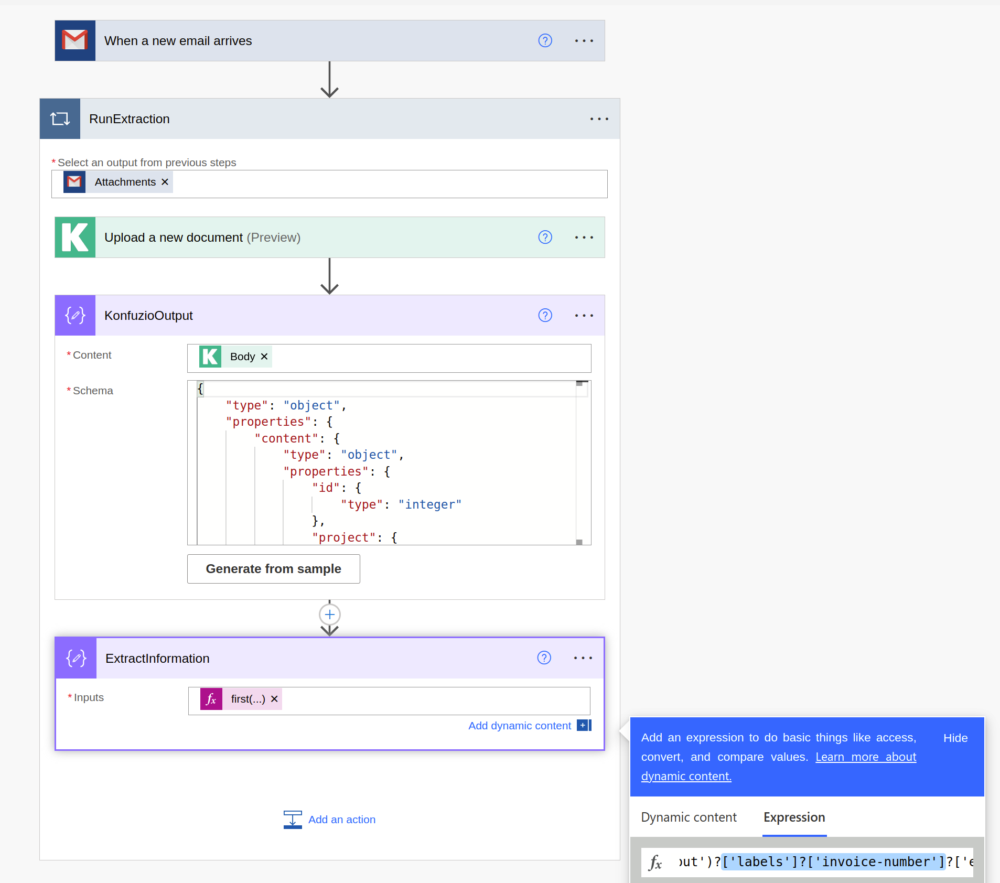
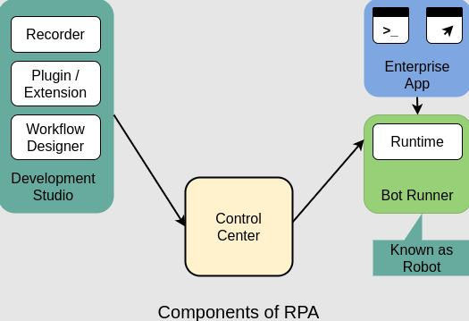
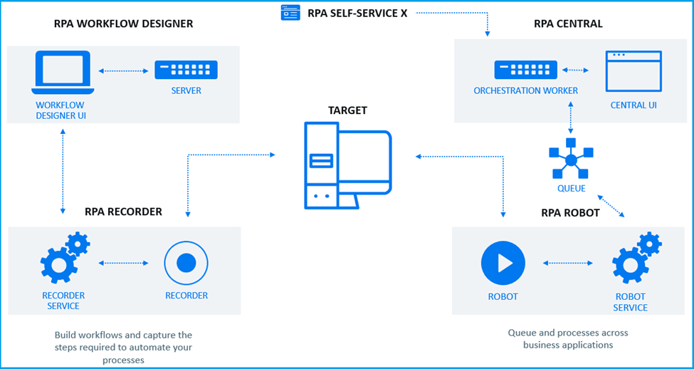
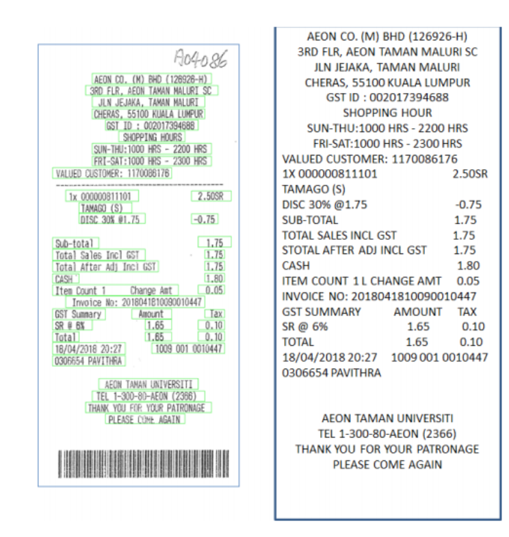

<!-- _class: titlepage -->

# <i>Robotic Process Automation</i> (RPA)

## Robótica - Grado en Ingeniería de Computadores

### Departamento de Sistemas Informáticos

#### E.T.S.I. de Sistemas Informáticos - Universidad Politécnica de Madrid

---

# Objetivos de aprendizaje de hoy

- Definir formalmente qué es RPA y diferenciarlo tanto de la automatización tradicional como de un softbot programado a mano
- Conocer la arquitectura interna de una plataforma RPA y cómo identifica elementos de una interfaz
- Entender el procesamiento inteligente de documentos (IDP) como complemento habitual de RPA
- Situar RPA en el panorama actual: hiperautomatización y automatización agéntica
- Valorar de forma crítica los límites técnicos, económicos y éticos de esta tecnología

---

<!-- _class: section -->

# Bloque 1
## ¿Qué es RPA?

---

# Automatización Robótica de Procesos

**RPA** (_Robotic Process Automation_) es la tecnología para configurar softbots que procesan transacciones, manipulan datos, generan respuestas y se comunican con otros sistemas, sin necesidad de modificar esos sistemas por dentro.

- El nombre es, en cierto modo, engañoso: no hay "robots" físicos, son agentes software
- La idea central que veremos hoy: **RPA no es un concepto nuevo**, es la industrialización de los softbots vistos anteriormente

---

# Automatización Robótica de Procesos

> Fuente: https://konfuzio.com/es/ejemplos-de-microsoft-power-automate/

---

# Evolución histórica

| Década | Hito |
|---|---|
| 2000s | Inicios con _scripts_ y automatización básica de tareas |
| 2010s | Madurez y adopción, con la aparición de plataformas dedicadas |
| 2020-2025 | Integración de RPA con inteligencia artificial (IDP, IA conversacional) |
| 2025-Actualidad | Automatización **agéntica**: RPA determinista orquestada junto a agentes de IA generativa$^1$ |

> $^1$ Volveremos sobre este en al final de las fiapositivas, que es el más relevante para entender hacia dónde va el campo ahora mismo.
---

# Por qué importa RPA

- **Eficiencia operacional**: automatiza tareas repetitivas, liberando tiempo humano para trabajo de mayor valor
- **Reducción de errores**: minimiza errores humanos en procesos críticos y repetitivos
- **Escalabilidad**: la automatización se ajusta a la demanda del negocio sin contratar más personal
- **Retorno de la inversión (ROI) rápido**: a diferencia de un proyecto de TI tradicional, un proceso RPA bien elegido puede desplegarse en semanas, no meses

---

# Automatización tradicional vs. RPA

**Automatización tradicional**

- Requiere integración a nivel de sistema o código: modificar aplicaciones existentes o desarrollar nuevas interfaces
- Llevada a cabo por desarrolladores y equipos de TI
- Esfuerzo considerable de implementación y mantenimiento

**RPA**

- Interactúa a nivel de la **interfaz de usuario** (UI), replicando clics, teclas y otras acciones humanas
- Puede configurarla personal **no técnico**, mediante grabadoras y editores gráficos
- Implementación rápida y mantenimiento comparativamente más sencillo

---

# La tesis central: RPA frente a softbots

Anteriormente se vió como programar un softbot a mano: código Python, peticiones HTTP, `BeautifulSoup`, Selenium...

RPA hace **exactamente lo mismo** conceptualmente, con dos diferencias clave:

| | Softbot de 4.2 | RPA |
|---|---|---|
| Quién lo construye | Alguien que programa | Alguien de negocio, sin programar |
| Cómo se define el comportamiento | Código | Grabación + editor gráfico |
| Percepción/acción típica | API, HTML/DOM | Interfaz de usuario (UI) |

> La única diferencia real entre programar un softbot y usar RPA es **la forma de programarlo**. El concepto de fondo, un agente que percibe y actúa, es el mismo

---

# Bots attended vs. unattended

Una distinción fundamental en cualquier plataforma RPA seria:

- **Attended (asistidos)**: se ejecutan en el puesto de un empleado, como apoyo durante una tarea, e.g. un bot que rellena automáticamente un formulario mientras un agente humano sigue al teléfono
- **Unattended (desatendidos)**: se ejecutan de forma autónoma, sin supervisión humana directa, típicamente en un servidor y según una programación o disparados por eventos

Esta distinción determina buena parte del diseño de gobernanza y seguridad de una implantación RPA real.

---

<!-- _class: section -->

# Bloque 2
## Arquitectura de una plataforma RPA

---

# Componentes de una plataforma RPA

Toda plataforma RPA seria se organiza en torno a tres piezas:

- **Diseñador/grabador**: entorno donde se define visualmente el proceso a automatizar
- **Robot de ejecución**: el proceso que efectivamente interactúa con las aplicaciones y ejecuta las acciones grabadas
- **Orquestador** (orchestrator / control room): consola central que despliega, programa, monitoriza y da de baja robots a escala, gestiona credenciales y colas de trabajo

El orquestador es, en cierto modo, el equivalente empresarial al planificador (`cron`/`APScheduler`) y al sistema de logging que ya hemos visto.

---

# Componentes de una plataforma RPA

> Fuente: https://www.learnovita.com/robotic-process-automation-with-python-rpa-tutorial

---

# ¿Cómo identifica RPA los elementos de una interfaz?

RPA necesita "apuntar" de forma fiable a un botón, un campo de texto o una tabla en una aplicación, igual que los softbots necesitan selectores CSS o XPath para apuntar a un nodo del DOM.

- **Selectors**: identificadores (a menudo basados en atributos de la interfaz: IDs, nombres de control, jerarquía de ventanas) que la plataforma usa para localizar un elemento de forma estable

**RPA basado en visión por computador**: cuando no hay selectors fiables (aplicaciones antiguas, interfaces renderizadas como imagen, escritorio remoto), la plataforma recurre a reconocimiento visual de elementos

---

# El ciclo de trabajo con RPA

1. **Grabación de tareas**: se captura cada clic, entrada de teclado y acción realizada en las aplicaciones
2. **Edición y configuración**: la tarea grabada se ajusta para manejar variaciones y excepciones
3. **Ejecución**: los bots ejecutan las tareas en un entorno controlado, en horarios programados o en respuesta a eventos
4. **Monitoreo y optimización**: se mide el desempeño de los bots y se recopilan datos para el análisis y la mejora continua del proceso

:warning: Nota importante: el paso 2 es, en la práctica, donde se concentra la mayor parte del esfuerzo real de un proyecto RPA, la grabación inicial es la parte fácil.

---

# El ciclo de trabajo con RPA

> Fuente: https://pankajsharma.hashnode.dev/what-is-a-workflow-in-rpa

---

<!-- _class: section -->

# Bloque 3
## Procesamiento inteligente de documentos (IDP)

---

# El problema de los datos no estructurados

Muchos procesos de negocio dependen de documentos que **no** tienen un formato estructurado y predecible: facturas, formularios rellenados a mano, contratos, PDFs escaneados.

Aquí entra en juego el **Procesamiento Inteligente de Documentos** (Intelligent Document Processing, IDP):

- **OCR** (reconocimiento óptico de caracteres) para convertir imágenes de texto en texto real
- Modelos de extracción (hoy, frecuentemente basados en IA/LLM) para identificar qué campo es cada dato, incluso cuando el formato varía

---

# El problema de los datos no estructurados

> Fuente: https://nanonets.com/blog/receipt-ocr/

---

# IDP + RPA: el tándem habitual en producción

En un proceso real (por ejemplo, procesamiento de facturas en el departamento financiero):

1. **IDP** extrae los datos relevantes del documento no estructurado
2. **RPA** toma esos datos ya estructurados y los introduce en el sistema correspondiente (ERP, contabilidad...)

Esta combinación es, en esencia, el mismo patrón de "percepción especializada + actuador genérico" que vimos con la extracción asistida por IA, aplicado ahora a documentos en lugar de páginas web.

---

<!-- _class: section -->

# Bloque 4
## Herramientas y plataformas

---

# Plataformas comerciales de referencia

- **[UiPath](https://www.uipath.com/)**: una de las plataformas RPA más extendidas, con entorno de diseño, orquestador y capacidades de IA integradas
- **[Automation Anywhere](https://www.automationanywhere.com/)**: automatización basada en la nube, con enfoque fuerte en IA generativa
- **[SS&C Blue Prism](https://www.blueprism.com/)**: originalmente enfocado en seguridad y cumplimiento normativo para industrias reguladas; desde su adquisición por SS&C Technologies en 2022 orienta su discurso hacia la automatización agéntica (SS&C Blue Prism, 2026)
- **[Microsoft Power Automate](https://powerautomate.microsoft.com/)**: integrado con el ecosistema Microsoft 365, con una capa creciente de agentes de IA (**Copilot**)

---

# Alternativas abiertas y ligeras

No todo el RPA pasa por licencias comerciales, hay opciones accesibles para aprender y prototipar sin coste:

- [**Robot Framework**](https://robotframework.org/): framework de automatización y pruebas de código abierto, extensible con librerías para web, escritorio y APIs
- [**TagUI**](https://aisingapore.org/aiproducts/tagui/): herramienta de automatización de código abierto orientada a flujos simples, con grabación de acciones
- [**OpenRPA**](https://openiap.io/openrpa): alternativa open-source con enfoque más cercano a las plataformas comerciales tradicionales
- [**n8n**](https://n8n.io/): de código abierto y centrado en automaticación con IA permite una programación a bajo nivel de la misma
- **Combinación "artesanal" en Python**: `Selenium`/`Playwright` + `APScheduler` + manejo de errores — literalmente el softbot que construimos en 4.2, usado como RPA casero

---

<!-- _class: section -->

# Bloque 5
## RPA + IA: hiperautomatización y automatización agéntica

---

# Automatización agéntica

RPA por sí solo automatiza bien lo **determinista**: pasos claros, reglas fijas. Todo lo que implica juicio, ambigüedad o lenguaje natural quedaba tradicionalmente fuera de su alcance — hasta la llegada de la IA generativa como complemento.

Hoy en día la conversación no es "IA frente a RPA", sino **flujos de trabajo agénticos** donde ambas piezas colaboran bajo una capa de orquestación común (Future AGI, 2026; SS&C Blue Prism, 2026):

- **RPA** gestiona la parte predecible y determinista del proceso
- **Agentes de IA** gestionan la parte impredecible: interpretar un correo ambiguo, decidir una excepción, redactar una respuesta
- Un **orquestador** superior coordina bots RPA, agentes de IA, APIs y personas dentro del mismo flujo

---

# Gobernanza en la era de la IA agéntica

Cuando un proceso automatizado toma decisiones, no solo ejecuta pasos fijos, la gobernanza deja de ser opcional:

- El **Reglamento de IA de la Unión Europea** exige, desde 2026, transparencia y trazabilidad para sistemas de IA que afectan a personas o a decisiones financieras
- **Auditabilidad**: poder explicar por qué un proceso automatizado tomó una decisión concreta, especialmente en sectores regulados (banca, salud)
- **Explicabilidad**: enlaza directamente con lo visto en las arquitecturas más deliberativas (BDI, agentes LLM con razonamiento explícito), que son más fáciles de auditar que una "caja negra" puramente reactiva

---

<!-- _class: section -->

# Bloque 6
## Límites y consideraciones críticas

---

# Fragilidad y coste oculto

RPA no es una solución sin fricciones:

- **Fragilidad ante cambios de interfaz**: si la aplicación automatizada cambia su UI, el bot puede romperse, el mismo problema que el scraping frente a cambios de HTML
- **Coste de mantenimiento infravalorado**: la fase de grabación es rápida, pero mantener decenas o cientos de bots frente a actualizaciones de software es un esfuerzo continuo y a menudo subestimado en el cálculo de ROI inicial
- **Proliferación descontrolada**: sin gobernanza, cada equipo crea sus propios bots sin coordinación ni estándares, generando un problema de mantenimiento a medio plazo

---

# Impacto laboral y ético

- La automatización de tareas administrativas repetitivas tiene un **impacto directo en determinados perfiles de empleo**, y conviene abordarlo con honestidad, no solo como "eficiencia"
- La respuesta más habitual en las organizaciones que implantan RPA de forma responsable es el _reskilling_: redirigir a las personas hacia tareas de mayor valor añadido, supervisión de excepciones o diseño de procesos
- Cuando se añaden agentes de IA generativa a un flujo, aparece un riesgo adicional: decisiones automatizadas basadas en un modelo que puede **alucinar** o interpretar mal una situación
---

<!-- _class: section -->

# Bloque 7
## Caso práctico

---

# De vuelta al softbot monitor de precios (4.2)

Recuperemos el softbot de 4.2 que vigilaba el precio de un producto, y pensemos cómo cambiaría si lo implementáramos como proceso RPA:

| Elemento | Softbot | Versión RPA |
|---|---|---|
| Percepción | `requests` + `BeautifulSoup` | Grabación de la navegación por la web del producto |
| Decisión | Regla condición-acción en Python | Regla configurada gráficamente en el editor |
| Acción | API de notificaciones | Paso de "email" en el diseñador |
| Ejecución | `APScheduler` | Programación en el orquestador |
| Mantenimiento | Desarrollador | Alguien del equipo, sin programar |

---

# ¡GRACIAS!<!--_class: endpage-->

---

<!-- _class: section -->

# Referencias

---

# Referencias (I)

Future AGI. (2026). *LLM agent architectures in 2026: Core components and patterns*. https://futureagi.com/blog/llm-agent-architectures-core-components/

Reglamento (UE) 2024/1689 del Parlamento Europeo y del Consejo, de 13 de junio de 2024, por el que se establecen normas armonizadas en materia de inteligencia artificial (Reglamento de IA). (2024). Diario Oficial de la Unión Europea.

SS&C Blue Prism. (2026, enero). *AI agent trends in 2026*. https://www.blueprism.com/resources/blog/future-ai-agents-trends/

SS&C Technologies. (2022). *SS&C completes acquisition of Blue Prism* [Nota de prensa]. https://www.ssctech.com/

---

# Referencias (II)

Documentación oficial de Robot Framework. https://robotframework.org

Documentación oficial de TagUI. https://github.com/tebelorg/TagUI

Documentación oficial de UiPath. https://docs.uipath.com

Documentación oficial de Microsoft Power Automate. https://learn.microsoft.com/power-automate/