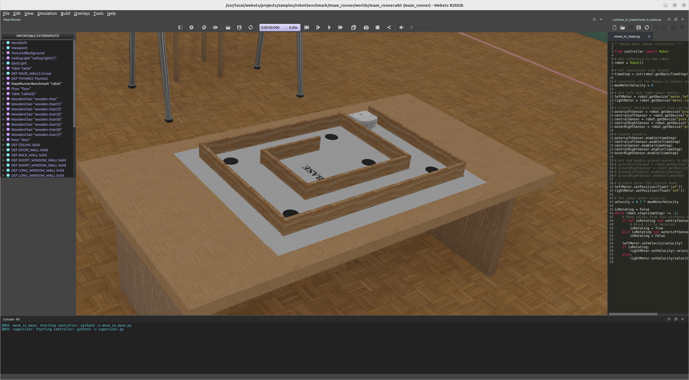

<!-- _class: titlepage -->

# El entorno de simulación Webots

## Robótica - Grado en Ingeniería de Computadores

### Departamento de Sistemas Informáticos

#### E.T.S.I. de Sistemas Informáticos - Universidad Politécnica de Madrid

##### 22 de octubre de 2023

[](https://creativecommons.org/licenses/by-nc-sa/4.0/)

---

# Introducción<!--_class: section-->

---

# Importancia de la simulación en robótica

Permite la prueba de algoritmos **antes** de implementarlos en hardware real

- Menor tiempo y coste de desarrollo
- **Entorno seguro para experimentar y aprender**

Facilita la **reproducción** y el análisis de situaciones específicas

- Es prácticamente imposible reproducir escenarios en el mundo real

Campos de aplicación:

- **Industria**: Desarrollo y prueba de algoritmos (p.ej. vehículos autónomos)
- **Academia**: Enseñanza e investigación, p.ej. en robótica o inteligencia artificial
- **Competiciones**: Preparación y entrenamiento en competiciones, p.ej. [RoboCup](https://www.robocup.org/)

---

# ¿Qué es Webots<sup>1</sup>?

Plataforma <i>Open Software</i> ([Apache License 2.0](https://www.apache.org/licenses/LICENSE-2.0)) para la simulación de robótica:

- Creación y uso de robots y entornos en un espacio tridimensional (o mundo)
- Biblioteca extensa de modelos predefinidos de [robots](https://cyberbotics.com/doc/guide/robots), [sensores](https://cyberbotics.com/doc/guide/sensors) y [actuadores](https://cyberbotics.com/doc/guide/actuators)
- Simulación precisa de físicas y renderizado [realistas](https://cyberbotics.com/doc/guide/appearances)

Entorno completo de modelado, programación y simulación para prototipado:

- Soporte para múltiples lenguajes de programación incluyendo C, C++ y Python
- Desarrollo de controladores de robot utilizando una API intuitiva
- Posibilidad de importar y exportar código para y desde otras plataformas
- Integración con robots y hardware real para pruebas en el mundo real

> <sup>1</sup> Sitio web oficial: <https://www.cyberbotics.com/>. 
> <sup>2</sup> Concretamente desde diciembre de 2018, desde la publicación de la versión [R2019a](https://www.cyberbotics.com/doc/blog/Webots-2019-a-release)

---

# Algunos términos comunes

**Mundo**: Fichero que contiene las descripciones de los robots y su entorno

**Controlador**: Programa con el código que controla cualquier robot del mundo

**Controlador supervisor**: Aquel que permite funciones de administración

**Nodo**: Cada objeto existente en el escenario o mundo

**Campo**, propiedad o característica: campo variable en el nodo

---

# Instalación del simulador

En Windows, basta con descargar el instalador de la última versión y lanzarlo.

En macOS, dos opciones:

1. Descargar el fichero de instalación `.dmg` de la aplicación e instalar
2. Instalar a través de <i>homebrew</i>

En GNU/Linux, varias opciones:

1. **Añadiendo el repositorio como fuente adicional del APT (recomendado).**
2. Desde un <i>tarball</i> (`.tar.bz2`) o un paquete `.deb` en el caso de Debian
3. Instalando el paquete disponible en `snap`
4. Contenedores docker (generalmente para simulaciones <i>headless</i>)

> Existen también contenedores de docker y servidor para, por ejemplo, el lanzamiento de simulaciones <i>headless</i>.

---

# Un vistazo a la interfaz<!--_class: section-->

---



---

# Interfaz de Webots

**Barra de menú**: Accesos a todos los aspectos de la aplicación.

**Barra de herramientas principal**: Trabajo sobre la simulación

**Árbol de escena**: Información jerárquica acerca del mundo, objetos y robots.

- `Worldinfo`: Parámetros como el paso de simulación y la gravedad.
- `Viewpoint`: Parámetros relacionados con la perspectiva de visualización.
- **Editor de dominio**: Modificación de caracteristicas del nodo seleccionado.

**Pantalla de simulación**: Ventana para la visualización de la simulación.

**Editor de texto**: Sirve para editar los controladores de los robots.

**Consola**: Salida estándar para los controladores que estén funcionando

---

# Jerarquía de archivos en un proyecto<!--_class: section-->

---

# Estructura base de directorios

[<i>The standard file hierarchy of a project</i>](https://cyberbotics.com/doc/guide/the-standard-file-hierarchy-of-a-project)

Un proyecto es un directorio con, al menos, un directorio denominado `world/`

- Contiene ficheros de descripción de mundo (`.wbt`) y archivos del proyecto
- **Deberá incluir al menos** un fichero con extensión `.wbt`
- Puede incluir un directorio `textures\` con las texturas a utilizar

Ahora bien, normalmente son necesarios más directorios; estos son:

- `controllers/`: Fuentes para el control de robots.
- `libraries/`: Posibles bibliotecas externas en el proyecto.
- `plugins/`: Plugins para alterar el comportamiento típico de la simulación
- `protos/`: Prototipos disponibles para todos los ficheros del proyecto.

---

# Ficheros asociados a un mundo

Cada mundo (e.g. `world.wbt`) lleva asociados los siguientes ficheros ocultos:

- `.world.wbproj`: Información sobre la UI del usuario (e.g. perspectiva).
- `.world.jpg`: Imagen de carga de 768x432 en simulaciones o animaciones.

Si no existen o se eliminan, se crean al guardar correctamente el mundo.

---

# El directorio `controllers/`

Contiene un **directorio por cada posible controlador** de la simulación:

- El `.wbt` contiene el nombre del controlador a iniciarse para cada robot.
- Ese nombre hace referencia al **directorio del controlador**
- Es un campo independiente de plataforma y lenguaje (sólo es una cadena)

Cuando Webots intenta inicializar un controlador sigue el siguiente proceso:

1. Busca en `controllers/` un directorio que coincida con el nombre indicado
1. Busca en el subdirectorio un fichero que coincida con el nombre indicado
1. Si hay varios, selecciona uno de ellos siguiendo el siguiente orden:
   ```bash
   [.exe] > .class > .jar > .bsg > .py > .m
   ```
1. Si no encuentra ninguno, lanzará un error y iniciará un controlador vacío

---

# Prácticas de webots<!--_class: section-->

---

# Flujo de trabajo

A la hora de editar el mundo de webots, se deben seguir los siguientes pasos:

1. Reiniciar la simulación
2. Editar el mundo
3. Guardar los cambios
4. Lanzar la simulación

¡Cuidado con reinitar la simulación sin guardar los cambios! Se perderán

---

# Tutoriales de Webots

¿Para qué repetir lo que ya está bien explicado?. Hagámoslo práctico:

1. [Tutorial 1: Introducción y primera simulación](https://cyberbotics.com/doc/guide/tutorial-1-your-first-simulation-in-webots)
2. [Tutorial 2: Modificando el entorno](https://cyberbotics.com/doc/guide/tutorial-2-modification-of-the-environment)
3. [Tutorial 3: Cambios de apariencia](https://cyberbotics.com/doc/guide/tutorial-3-appearance)
4. [Tutorial 4: Sobre los controladores de un robot](https://cyberbotics.com/doc/guide/tutorial-4-more-about-controllers)
5. [Tutorial 5: Sólidos y físicas](https://cyberbotics.com/doc/guide/tutorial-5-compound-solid-and-physics-attributes)
6. [Tutorial 6: Creando un robot de cuatro ruedas](https://cyberbotics.com/doc/guide/tutorial-6-4-wheels-robot)
7. [Tutorial 7: Creación de PROTO para la reutilización](https://cyberbotics.com/doc/guide/tutorial-7-your-first-proto)

El tutorial es interesante pero no lo necesitamos. El 9 no sirve para nada

---

# ¡GRACIAS!<!--_class: endpage -->
